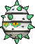
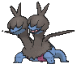

# Meteor Falls — Wild Pokémon

## [ 1F ]

### Grass

| Sprite | Pokémon | Encounter | Chance |
|:------:|---------|:---------:|--------|
|  | [Clefairy](../../pokemon/clefairy.md/) Lv. 25 |  Grass | 10% |
|  | [Golbat](../../pokemon/golbat.md/) Lv. 25 |  Grass | 10% |
|  | [Larvitar](../../pokemon/larvitar.md/) Lv. 25 |  Grass | 10% |
|  | [Lunatone](../../pokemon/lunatone.md/) Lv. 25 |  Grass | 10% |
|  | [Solrock](../../pokemon/solrock.md/) Lv. 25 |  Grass | 10% |
|  | [Bagon](../../pokemon/bagon.md/) Lv. 25 |  Grass | 10% |
|  | [Beldum](../../pokemon/beldum.md/) Lv. 25 |  Grass | 10% |
|  | [Ferroseed](../../pokemon/ferroseed.md/) Lv. 25 |  Grass | 10% |
|  | [Druddigon*](../../pokemon/druddigon.md/) Lv. 25 |  Grass | 5% |
|  | [Deino](../../pokemon/deino.md/) Lv. 25 |  Grass | 10% |
|  | [Carbink*](../../pokemon/carbink.md/) Lv. 25 |  Grass | 5% |

### DexNav

| Sprite | Pokémon | Encounter | Chance |
|:------:|---------|:---------:|--------|
|  | [Clefable](../../pokemon/clefable.md/) Lv. 50 |  DexNav | 100% |

### Horde

| Sprite | Pokémon | Encounter | Chance |
|:------:|---------|:---------:|--------|
|  | [Cleffa](../../pokemon/cleffa.md/) Lv. 16 |  Horde | 100% |

### Surfing

| Sprite | Pokémon | Encounter | Chance |
|:------:|---------|:---------:|--------|
|  | [Golbat](../../pokemon/golbat.md/) Lv. 25 - 35 |  Surfing | 100% |

### Old Rod

| Sprite | Pokémon | Encounter | Chance |
|:------:|---------|:---------:|--------|
|  | [Dratini](../../pokemon/dratini.md/) Lv. 25 |  Old Rod | 100% |

### Good Rod

| Sprite | Pokémon | Encounter | Chance |
|:------:|---------|:---------:|--------|
|  | [Dratini](../../pokemon/dratini.md/) Lv. 35 |  Good Rod | 100% |

### Super Rod

| Sprite | Pokémon | Encounter | Chance |
|:------:|---------|:---------:|--------|
|  | [Dragonair](../../pokemon/dragonair.md/) Lv. 55 |  Super Rod | 100% |

## [ 1F / 2F ]

### Cave

| Sprite | Pokémon | Encounter | Chance |
|:------:|---------|:---------:|--------|
|  | [Clefairy](../../pokemon/clefairy.md/) Lv. 59 |  Cave | 10% |
|  | [Golbat](../../pokemon/golbat.md/) Lv. 59 |  Cave | 10% |
|  | [Pupitar](../../pokemon/pupitar.md/) Lv. 59 |  Cave | 10% |
|  | [Lunatone](../../pokemon/lunatone.md/) Lv. 59 |  Cave | 10% |
|  | [Solrock](../../pokemon/solrock.md/) Lv. 59 |  Cave | 10% |
|  | [Shelgon](../../pokemon/shelgon.md/) Lv. 59 |  Cave | 10% |
|  | [Metang](../../pokemon/metang.md/) Lv. 59 |  Cave | 10% |
|  | [Ferrothorn](../../pokemon/ferrothorn.md/) Lv. 59 |  Cave | 10% |
|  | [Druddigon*](../../pokemon/druddigon.md/) Lv. 59 |  Cave | 5% |
|  | [Zweilous](../../pokemon/zweilous.md/) Lv. 59 |  Cave | 10% |
|  | [Carbink*](../../pokemon/carbink.md/) Lv. 59 |  Cave | 5% |

### DexNav

| Sprite | Pokémon | Encounter | Chance |
|:------:|---------|:---------:|--------|
|  | [Clefable](../../pokemon/clefable.md/) Lv. 60 |  DexNav | 100% |

### Horde

| Sprite | Pokémon | Encounter | Chance |
|:------:|---------|:---------:|--------|
|  | [Clefairy](../../pokemon/clefairy.md/) Lv. 37 |  Horde | 100% |

### Surfing

| Sprite | Pokémon | Encounter | Chance |
|:------:|---------|:---------:|--------|
|  | [Golbat](../../pokemon/golbat.md/) Lv. 55 - 65 |  Surfing | 50% |
|  | [Solrock](../../pokemon/solrock.md/) Lv. 55 - 65 |  Surfing | 50% |

### Old Rod

| Sprite | Pokémon | Encounter | Chance |
|:------:|---------|:---------:|--------|
|  | [Dratini](../../pokemon/dratini.md/) Lv. 15 |  Old Rod | 100% |

### Good Rod

| Sprite | Pokémon | Encounter | Chance |
|:------:|---------|:---------:|--------|
|  | [Dratini](../../pokemon/dratini.md/) Lv. 35 |  Good Rod | 100% |

### Super Rod

| Sprite | Pokémon | Encounter | Chance |
|:------:|---------|:---------:|--------|
|  | [Dragonair](../../pokemon/dragonair.md/) Lv. 55 |  Super Rod | 100% |

## [ B1F ]

### Cave

| Sprite | Pokémon | Encounter | Chance |
|:------:|---------|:---------:|--------|
|  | [Clefairy](../../pokemon/clefairy.md/) Lv. 59 |  Cave | 10% |
|  | [Golbat](../../pokemon/golbat.md/) Lv. 59 |  Cave | 10% |
|  | [Pupitar](../../pokemon/pupitar.md/) Lv. 59 |  Cave | 10% |
|  | [Lunatone](../../pokemon/lunatone.md/) Lv. 59 |  Cave | 10% |
|  | [Solrock](../../pokemon/solrock.md/) Lv. 59 |  Cave | 10% |
|  | [Shelgon](../../pokemon/shelgon.md/) Lv. 59 |  Cave | 10% |
|  | [Metang](../../pokemon/metang.md/) Lv. 59 |  Cave | 10% |
|  | [Ferrothorn](../../pokemon/ferrothorn.md/) Lv. 59 |  Cave | 10% |
|  | [Druddigon*](../../pokemon/druddigon.md/) Lv. 59 |  Cave | 5% |
|  | [Zweilous](../../pokemon/zweilous.md/) Lv. 59 |  Cave | 10% |
|  | [Carbink*](../../pokemon/carbink.md/) Lv. 59 |  Cave | 5% |

### DexNav

| Sprite | Pokémon | Encounter | Chance |
|:------:|---------|:---------:|--------|
|  | [Crobat](../../pokemon/crobat.md/) Lv. 60 |  DexNav | 100% |

### Horde

| Sprite | Pokémon | Encounter | Chance |
|:------:|---------|:---------:|--------|
|  | [Clefairy](../../pokemon/clefairy.md/) Lv. 37 |  Horde | 100% |

### Surfing

| Sprite | Pokémon | Encounter | Chance |
|:------:|---------|:---------:|--------|
|  | [Golbat](../../pokemon/golbat.md/) Lv. 55 - 65 |  Surfing | 50% |
|  | [Lunatone](../../pokemon/lunatone.md/) Lv. 55 - 65 |  Surfing | 50% |

### Old Rod

| Sprite | Pokémon | Encounter | Chance |
|:------:|---------|:---------:|--------|
|  | [Dratini](../../pokemon/dratini.md/) Lv. 15 |  Old Rod | 100% |

### Good Rod

| Sprite | Pokémon | Encounter | Chance |
|:------:|---------|:---------:|--------|
|  | [Dratini](../../pokemon/dratini.md/) Lv. 35 |  Good Rod | 100% |

### Super Rod

| Sprite | Pokémon | Encounter | Chance |
|:------:|---------|:---------:|--------|
|  | [Dragonair](../../pokemon/dragonair.md/) Lv. 55 |  Super Rod | 100% |

## [ B1F / B2F ]

### Cave

| Sprite | Pokémon | Encounter | Chance |
|:------:|---------|:---------:|--------|
|  | [Clefairy](../../pokemon/clefairy.md/) Lv. 59 |  Cave | 10% |
|  | [Golbat](../../pokemon/golbat.md/) Lv. 59 |  Cave | 10% |
|  | [Pupitar](../../pokemon/pupitar.md/) Lv. 59 |  Cave | 10% |
|  | [Lunatone](../../pokemon/lunatone.md/) Lv. 59 |  Cave | 10% |
|  | [Solrock](../../pokemon/solrock.md/) Lv. 59 |  Cave | 10% |
|  | [Shelgon](../../pokemon/shelgon.md/) Lv. 59 |  Cave | 10% |
|  | [Metang](../../pokemon/metang.md/) Lv. 59 |  Cave | 10% |
|  | [Ferrothorn](../../pokemon/ferrothorn.md/) Lv. 59 |  Cave | 10% |
|  | [Druddigon*](../../pokemon/druddigon.md/) Lv. 59 |  Cave | 5% |
|  | [Zweilous](../../pokemon/zweilous.md/) Lv. 59 |  Cave | 10% |
|  | [Carbink*](../../pokemon/carbink.md/) Lv. 59 |  Cave | 5% |

### DexNav

| Sprite | Pokémon | Encounter | Chance |
|:------:|---------|:---------:|--------|
|  | [Salamence](../../pokemon/salamence.md/) Lv. 60 |  DexNav | 100% |

### Horde

| Sprite | Pokémon | Encounter | Chance |
|:------:|---------|:---------:|--------|
|  | [Bagon](../../pokemon/bagon.md/) Lv. 37 |  Horde | 100% |

### Surfing

| Sprite | Pokémon | Encounter | Chance |
|:------:|---------|:---------:|--------|
|  | [Golbat](../../pokemon/golbat.md/) Lv. 55 - 65 |  Surfing | 100% |

### Old Rod

| Sprite | Pokémon | Encounter | Chance |
|:------:|---------|:---------:|--------|
|  | [Dratini](../../pokemon/dratini.md/) Lv. 15 |  Old Rod | 100% |

### Good Rod

| Sprite | Pokémon | Encounter | Chance |
|:------:|---------|:---------:|--------|
|  | [Dratini](../../pokemon/dratini.md/) Lv. 35 |  Good Rod | 100% |

### Super Rod

| Sprite | Pokémon | Encounter | Chance |
|:------:|---------|:---------:|--------|
|  | [Dragonair](../../pokemon/dragonair.md/) Lv. 55 |  Super Rod | 100% |

