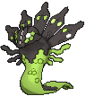
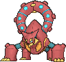

# Mirage Cave — Wild Pokémon

**Hint:** <i>580 BST Pokémon are Lv. 65. 600 BST Pokémon are Lv. 68. Anything higher is Lv. 70.</i>

### Cave

| Sprite | Pokémon | Encounter Type | Level | Chance |
|:------:|---------|:--------------:|-------|--------|
|  | [Mewtwo*](../../pokemon/mewtwo.md/) |  Cave | 65 - 70 | 5% |
|  | [Kyogre](../../pokemon/kyogre.md/) |  Cave | 65 - 70 | 10% |
|  | [Groudon](../../pokemon/groudon.md/) |  Cave | 65 - 70 | 10% |
|  | [Jirachi](../../pokemon/jirachi.md/) |  Cave | 65 - 70 | 10% |
|  | [Uxie](../../pokemon/uxie.md/) |  Cave | 65 - 70 | 10% |
|  | [Mesprit](../../pokemon/mesprit.md/) |  Cave | 65 - 70 | 10% |
|  | [Azelf](../../pokemon/azelf.md/) |  Cave | 65 - 70 | 10% |
|  | [Genesect](../../pokemon/genesect.md/) |  Cave | 65 - 70 | 10% |
|  | [Zygarde*](../../pokemon/zygarde-50.md/) |  Cave | 65 - 70 | 5% |
|  | [Diancie](../../pokemon/diancie.md/) |  Cave | 65 - 70 | 10% |
|  | [Volcanion](../../pokemon/volcanion.md/) |  Cave | 65 - 70 | 10% |

### Rock Smash

| Sprite | Pokémon | Encounter Type | Level | Chance |
|:------:|---------|:--------------:|-------|--------|
|  | [Ditto](../../pokemon/ditto.md/) |  Rock Smash | 60 | 100% |

