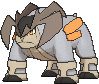

# Mirage Forest — Wild Pokémon

**Hint:** <i>580 BST Pokémon are Lv. 65. 600 BST Pokémon are Lv. 68. Anything higher is Lv. 70.</i>

### Grass

| Sprite | Pokémon | Encounter Type | Level | Chance |
|:------:|---------|:--------------:|-------|--------|
|  | [Raikou](../../pokemon/raikou.md/) |  Grass | 65 - 70 | 10% |
|  | [Entei](../../pokemon/entei.md/) |  Grass | 65 - 70 | 10% |
|  | [Suicune](../../pokemon/suicune.md/) |  Grass | 65 - 70 | 10% |
|  | [Celebi*](../../pokemon/celebi.md/) |  Grass | 65 - 70 | 5% |
|  | [Shaymin](../../pokemon/shaymin-land.md/) |  Grass | 65 - 70 | 10% |
|  | [Cobalion](../../pokemon/cobalion.md/) |  Grass | 65 - 70 | 10% |
|  | [Terrakion](../../pokemon/terrakion.md/) |  Grass | 65 - 70 | 10% |
|  | [Virizion](../../pokemon/virizion.md/) |  Grass | 65 - 70 | 10% |
|  | [Keldeo](../../pokemon/keldeo-ordinary.md/) |  Grass | 65 - 70 | 10% |
|  | [Meloetta](../../pokemon/meloetta-aria.md/) |  Grass | 65 - 70 | 10% |
|  | [Xerneas*](../../pokemon/xerneas.md/) |  Grass | 65 - 70 | 5% |

### Rock Smash

| Sprite | Pokémon | Encounter Type | Level | Chance |
|:------:|---------|:--------------:|-------|--------|
|  | [Ditto](../../pokemon/ditto.md/) |  Rock Smash | 60 | 100% |

