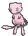
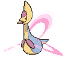
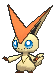

# Mirage Island — Wild Pokémon

**Hint:** <i>580 BST Pokémon are Lv. 65. 600 BST Pokémon are Lv. 68. Anything higher is Lv. 70.</i>

### Grass

| Sprite | Pokémon | Encounter Type | Level | Chance |
|:------:|---------|:--------------:|-------|--------|
|  | [Mew*](../../pokemon/mew.md/) |  Grass | 65 - 68 | 5% |
|  | [Latias](../../pokemon/latias.md/) |  Grass | 65 - 68 | 10% |
|  | [Latios](../../pokemon/latios.md/) |  Grass | 65 - 68 | 10% |
|  | [Manaphy](../../pokemon/manaphy.md/) |  Grass | 65 - 68 | 10% |
|  | [Cresselia](../../pokemon/cresselia.md/) |  Grass | 65 - 68 | 10% |
|  | [Darkrai](../../pokemon/darkrai.md/) |  Grass | 65 - 68 | 10% |
|  | [Victini](../../pokemon/victini.md/) |  Grass | 65 - 68 | 10% |
|  | [Tornadus](../../pokemon/tornadus-incarnate.md/) |  Grass | 65 - 68 | 10% |
|  | [Thundurus](../../pokemon/thundurus-incarnate.md/) |  Grass | 65 - 68 | 10% |
|  | [Landorus](../../pokemon/landorus-incarnate.md/) |  Grass | 65 - 68 | 10% |
|  | [Hoopa*](../../pokemon/hoopa.md/) |  Grass | 65 - 68 | 5% |

### Rock Smash

| Sprite | Pokémon | Encounter Type | Level | Chance |
|:------:|---------|:--------------:|-------|--------|
|  | [Ditto](../../pokemon/ditto.md/) |  Rock Smash | 50 | 100% |

