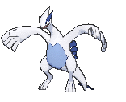
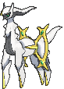

# Mirage Mountain — Wild Pokémon

## [ Main Area (Postgame) ]

**Hint:** <i>580 BST Pokémon are Lv. 65. 600 BST Pokémon are Lv. 68. 670/680 BST Pokémon are Lv. 70. 720 BST Pokémon are Lv. 80.</i>

### Grass

| Sprite | Pokémon | Encounter Type | Chance |
|:------:|---------|:--------------:|--------|
|  | [Articuno](../../pokemon/articuno.md/) Lv. 65 - 80 |  Grass | 10% |
|  | [Zapdos](../../pokemon/zapdos.md/) Lv. 65 - 80 |  Grass | 10% |
|  | [Moltres](../../pokemon/moltres.md/) Lv. 65 - 80 |  Grass | 10% |
|  | [Lugia](../../pokemon/lugia.md/) Lv. 65 - 80 |  Grass | 10% |
|  | [Ho-oh](../../pokemon/ho-oh.md/) Lv. 65 - 80 |  Grass | 10% |
|  | [Dialga](../../pokemon/dialga.md/) Lv. 65 - 80 |  Grass | 10% |
|  | [Palkia](../../pokemon/palkia.md/) Lv. 65 - 80 |  Grass | 10% |
|  | [Arceus*](../../pokemon/arceus.md/) Lv. 65 - 80 |  Grass | 5% |
|  | [Reshiram](../../pokemon/reshiram.md/) Lv. 65 - 80 |  Grass | 10% |
|  | [Zekrom](../../pokemon/zekrom.md/) Lv. 65 - 80 |  Grass | 10% |
|  | [Yveltal*](../../pokemon/yveltal.md/) Lv. 65 - 80 |  Grass | 5% |

### Rock Smash

| Sprite | Pokémon | Encounter Type | Chance |
|:------:|---------|:--------------:|--------|
|  | [Ditto](../../pokemon/ditto.md/) Lv. 60 |  Rock Smash | 100% |

