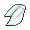
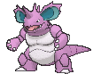

# Mossdeep City — Special Battles

---

## [ Gym ]

### Liza & Tate

| Pokémon | Attributes | Item | Moves |
|:-------:|------------|:----:|-------|
|  | **Lv. 60** [Solrock](../../pokemon/solrock.md) **Ability:** Levitate   |  Focus Sash | 1. Light Screen 2. Protect 3. Stone Edge 4. Flare Blitz |
|  | **Lv. 60** [Lunatone](../../pokemon/lunatone.md) **Ability:** Levitate   |  Focus Sash | 1. Reflect 2. Protect 3. Psychic 4. Moonblast |
|  | **Lv. 60** [Bronzong](../../pokemon/bronzong.md) **Ability:** Levitate   |  Sitrus Berry | 1. Reflect 2. Hypnosis 3. Gyro Ball 4. Earthquake |
|  | **Lv. 60** [Slowking](../../pokemon/slowking.md) **Ability:** Own Tempo   |  Assault Vest | 1. Scald 2. Focus Blast 3. Psychic 4. Fire Blast |
|  | **Lv. 62** [Gallade](../../pokemon/gallade.md) **Ability:** Justified   |  Life Orb | 1. Close Combat 2. Zen Headbutt 3. Knock Off 4. Leaf Blade |
|  | **Lv. 62** [Gardevoir](../../pokemon/gardevoir.md) **Ability:** Trace   |  Gardevoirite | 1. Hyper Voice 2. Psychic 3. Thunderbolt 4. Protect |

---

## [ Main Area (Postgame) ]

### Courtney

| Pokémon | Attributes | Item | Moves |
|:-------:|------------|:----:|-------|
|  | **Lv. 79** [Charizard](../../pokemon/charizard.md) **Ability:** Blaze   |  Charizardite Y | 1. Fire Blast 2. Air Slash 3. Focus Blast 4. Solar Beam |
|  | **Lv. 77** [Pyroar](../../pokemon/pyroar.md) **Ability:** Rivalry   |  Silk Scarf | 1. Hyper Voice 2. Flamethrower 3. Dark Pulse 4. Attract |
|  | **Lv. 77** [Nidoking](../../pokemon/nidoking.md) **Ability:** Sheer Force   |  Life Orb | 1. Sludge Bomb 2. Earth Power 3. Fire Blast 4. Thunder |

### Matt

| Pokémon | Attributes | Item | Moves |
|:-------:|------------|:----:|-------|
|  | **Lv. 79** [Blastoise](../../pokemon/blastoise.md) **Ability:** Torrent  |  Blastoisinite | 1. Hydro Pump 2. Aura Sphere 3. Dark Pulse 4. Ice Beam |
|  | **Lv. 77** [Barbaracle](../../pokemon/barbaracle.md) **Ability:** Tough Claws   |  Assault Vest | 1. Razor Shell 2. Cross Chop 3. Stone Edge 4. X-Scissor |
|  | **Lv. 77** [Nidoqueen](../../pokemon/nidoqueen.md) **Ability:** Sheer Force   |  Life Orb | 1. Sludge Bomb 2. Earth Power 3. Blizzard 4. Thunder |

