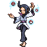
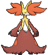
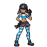

# Mossdeep City — Trainer Pokémon

---

## [ Gym ]

### Trainer Rosters

| Trainer | P1 | P2 | P3 | P4 | P5 | P6 |
|:-------:|:--:|:--:|:--:|:--:|:--:|:--:|
|  Psychic Preston [157] | 
 [Hypno](../../pokemon/hypno.md) Lv. 59
 | 
 [Beheeyem](../../pokemon/beheeyem.md) Lv. 59
 | 
 [Meowstic](../../pokemon/meowstic-male.md) Lv. 59
 |
|  Psychic Joshua [226] | 
 [Reuniclus](../../pokemon/reuniclus.md) Lv. 59
 | 
 [Espeon](../../pokemon/espeon.md) Lv. 59
 | 
 [Exeggutor](../../pokemon/exeggutor.md) Lv. 59
 |
|  Psychic Fritz [159] | 
 [Grumpig](../../pokemon/grumpig.md) Lv. 59
 | 
 [Starmie](../../pokemon/starmie.md) Lv. 59
 | 
 [Alakazam](../../pokemon/alakazam.md) Lv. 59
 |
|  Hex Maniac Kindra [320] | 
 [Wobbuffet](../../pokemon/wobbuffet.md) Lv. 59
 | 
 [Gothitelle](../../pokemon/gothitelle.md) Lv. 59
 | 
 [Claydol](../../pokemon/claydol.md) Lv. 59
 |
|  Hex Maniac Patricia [225] | 
 [Jynx](../../pokemon/jynx.md) Lv. 59
 | 
 [Mr. Mime](../../pokemon/mr-mime.md) Lv. 59
 | 
 [Delphox](../../pokemon/delphox.md) Lv. 59
 |
|  Psychic Virgil [158] | 
 [Malamar](../../pokemon/malamar.md) Lv. 59
 | 
 [Musharna](../../pokemon/musharna.md) Lv. 59
 | 
 [Girafarig](../../pokemon/girafarig.md) Lv. 59
 |
|  Leaders Liza & Tate [552] | 
 [Solrock](../../pokemon/solrock.md) Lv. 60
 | 
 [Lunatone](../../pokemon/lunatone.md) Lv. 60
 | 
 [Bronzong](../../pokemon/bronzong.md) Lv. 60
 | 
 [Slowking](../../pokemon/slowking.md) Lv. 60
 | 
 [Gallade](../../pokemon/gallade.md) Lv. 62
 | 
 [Gardevoir](../../pokemon/gardevoir.md) Lv. 62
 |

### Special Battles

1. [Liza & Tate](special_battles.md#liza-tate)

---

## [ Main Area (Postgame) ]

### Trainer Rosters

| Trainer | P1 | P2 | P3 | P4 | P5 |
|:-------:|:--:|:--:|:--:|:--:|:--:|
| ![Team Magma Grunt [x5]](../../assets/trainers/magma_grunt.png "Team Magma Grunt [x5]") Team Magma Grunt [x5] [670] | 
 [Flareon](../../pokemon/flareon.md) Lv. 59
 | 
 [Flareon](../../pokemon/flareon.md) Lv. 59
 | 
 [Flareon](../../pokemon/flareon.md) Lv. 59
 | 
 [Flareon](../../pokemon/flareon.md) Lv. 59
 | 
 [Flareon](../../pokemon/flareon.md) Lv. 59
 |
|  Team Magma Grunt [901] | 
 [Ninetales](../../pokemon/ninetales.md) Lv. 75
 | 
 [Weezing](../../pokemon/weezing.md) Lv. 75
 | 
 [Emboar](../../pokemon/emboar.md) Lv. 75
 |
|  Magma Admin Courtney [698] | 
 [Charizard](../../pokemon/charizard.md) Lv. 79
 | 
 [Pyroar](../../pokemon/pyroar.md) Lv. 77
 | 
 [Nidoking](../../pokemon/nidoking.md) Lv. 77
 |
| ![Team Aqua Grunt [x5]](../../assets/trainers/aqua_grunt.png "Team Aqua Grunt [x5]") Team Aqua Grunt [x5] [673] | 
 [Vaporeon](../../pokemon/vaporeon.md) Lv. 59
 | 
 [Vaporeon](../../pokemon/vaporeon.md) Lv. 59
 | 
 [Vaporeon](../../pokemon/vaporeon.md) Lv. 59
 | 
 [Vaporeon](../../pokemon/vaporeon.md) Lv. 59
 | 
 [Vaporeon](../../pokemon/vaporeon.md) Lv. 59
 |
|  Team Aqua Grunt [905] | 
 [Politoed](../../pokemon/politoed.md) Lv. 75
 | 
 [Muk](../../pokemon/muk.md) Lv. 75
 | 
 [Feraligatr](../../pokemon/feraligatr.md) Lv. 75
 |
|  Aqua Admin Matt [688] | 
 [Blastoise](../../pokemon/blastoise.md) Lv. 79
 | 
 [Barbaracle](../../pokemon/barbaracle.md) Lv. 77
 | 
 [Nidoqueen](../../pokemon/nidoqueen.md) Lv. 77
 |

### Special Battles

1. [Courtney](special_battles.md#courtney)

1. [Matt](special_battles.md#matt)

