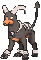
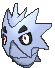
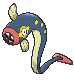

# Mt. Chimney — Special Battles

---

## [ Main Area ]

### Tabitha

| Pokémon | Attributes | Item | Moves |
|:-------:|------------|:----:|-------|
|  | **Lv. 33** [Mightyena](../../pokemon/mightyena.md) **Ability:** Intimidate  | Muscle Band | 1. Crunch 2. Play Rough 3. Fire Fang 4. Thunder Fang |
|  | **Lv. 33** [Weezing](../../pokemon/weezing.md) **Ability:** Levitate  | Wise Glasses | 1. Sludge Bomb 2. Flamethrower 3. Thunderbolt 4. Shadow Ball |
|  | **Lv. 33** [Snorlax](../../pokemon/snorlax.md) **Ability:** Thick Fat  | Sitrus Berry | 1. Body Slam 2. Rock Slide 3. Rest 4. Sleep Talk |
|  | **Lv. 35** [Darmanitan](../../pokemon/darmanitan-standard.md) **Ability:** Sheer Force  | Life Orb | 1. Flare Blitz 2. Hammer Arm 3. Zen Headbutt 4. Swagger |

### Shelly

| Pokémon | Attributes | Item | Moves |
|:-------:|------------|:----:|-------|
|  | **Lv. 33** [Liepard](../../pokemon/liepard.md) **Ability:** Prankster  | Muscle Band | 1. Night Slash 2. Fake Out 3. Play Rough 4. Attract |
|  | **Lv. 33** [Muk](../../pokemon/muk.md) **Ability:** Poison Touch  | Black Sludge | 1. Poison Jab 2. Rock Slide 3. Shadow Sneak 4. Minimize |
|  | **Lv. 33** [Lapras](../../pokemon/lapras.md) **Ability:** Water Absorb   | Sitrus Berry | 1. Scald 2. Ice Beam 3. Rest 4. Sleep Talk |
|  | **Lv. 35** [Jellicent](../../pokemon/jellicent.md) **Ability:** Cursed Body   | Life Orb | 1. Scald 2. Shadow Ball 3. Energy Ball 4. Recover |

### Maxie

| Pokémon | Attributes | Item | Moves |
|:-------:|------------|:----:|-------|
|  | **Lv. 34** [Golbat](../../pokemon/golbat.md) **Ability:** Infiltrator   | Flying Gem | 1. Acrobatics 2. Confuse Ray 3. Sludge Bomb 4. Torment |
|  | **Lv. 34** [Houndoom](../../pokemon/houndoom.md) **Ability:** Flash Fire   | Expert Belt | 1. Dark Pulse 2. Flamethrower 3. Thunder Fang 4. Will-O-Wisp |
|  | **Lv. 34** [Pupitar](../../pokemon/pupitar.md) **Ability:** Shed Skin   | Eviolite | 1. Rock Slide 2. Dig 3. Dragon Dance 4. Iron Head |
|  | **Lv. 34** [Lampent](../../pokemon/lampent.md) **Ability:** Flame Body   | Focus Sash | 1. Heat Wave 2. Shadow Ball 3. Will-O-Wisp 4. Energy Ball |
|  | **Lv. 36** [Camerupt](../../pokemon/camerupt.md) **Ability:** Solid Rock   | Quick Claw | 1. Earth Power 2. Lava Plume 3. Rock Slide 4. Flash Cannon |

### Archie

| Pokémon | Attributes | Item | Moves |
|:-------:|------------|:----:|-------|
|  | **Lv. 34** [Golbat](../../pokemon/golbat.md) **Ability:** Infiltrator   | Flying Gem | 1. Acrobatics 2. Confuse Ray 3. Sludge Bomb 4. Torment |
|  | **Lv. 34** [Tentacruel](../../pokemon/tentacruel.md) **Ability:** Rain Dish   | Black Sludge | 1. Poison Jab 2. Scald 3. Rain Dance 4. Aurora Beam |
|  | **Lv. 34** [Dragonair](../../pokemon/dragonair.md) **Ability:** Marvel Scale  | Eviolite | 1. Dragon Rush 2. Aqua Tail 3. Thunder Wave 4. Thunder |
|  | **Lv. 34** [Eelektrik](../../pokemon/eelektrik.md) **Ability:** Levitate  | Quick Claw | 1. Thunderbolt 2. Aqua Tail 3. Thunder Wave 4. Protect |
|  | **Lv. 36** [Sharpedo](../../pokemon/sharpedo.md) **Ability:** Speed Boost   | Focus Sash | 1. Night Slash 2. Ice Fang 3. Waterfall 4. Protect |

