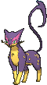

# Mt. Chimney — Trainer Pokémon

### Generic Trainers

| Trainer | P1 | P2 | P3 | P4 | P5 |
|:-------:|:--:|:--:|:--:|:--:|:--:|
|  Team Magma Grunt [252] | 
 [Golbat](../../pokemon/golbat.md) Lv. 32
 | 
 [Lairon](../../pokemon/lairon.md) Lv. 32
 |
|  Magma Admin Tabitha [692] | 
 [Mightyena](../../pokemon/mightyena.md) Lv. 33
 | 
 [Weezing](../../pokemon/weezing.md) Lv. 33
 | 
 [Snorlax](../../pokemon/snorlax.md) Lv. 33
 | 
 [Darmanitan](../../pokemon/darmanitan-standard.md) Lv. 35
 |
|  Magma Leader Maxie [236] | 
 [Golbat](../../pokemon/golbat.md) Lv. 34
 | 
 [Houndoom](../../pokemon/houndoom.md) Lv. 34
 | 
 [Pupitar](../../pokemon/pupitar.md) Lv. 34
 | 
 [Lampent](../../pokemon/lampent.md) Lv. 34
 | 
 [Camerupt](../../pokemon/camerupt.md) Lv. 36
 |
|  Team Aqua Grunt [233] | 
 [Golbat](../../pokemon/golbat.md) Lv. 32
 | 
 [Lumineon](../../pokemon/lumineon.md) Lv. 32
 |
|  Aqua Admin Shelly [689] | 
 [Liepard](../../pokemon/liepard.md) Lv. 33
 | 
 [Muk](../../pokemon/muk.md) Lv. 33
 | 
 [Lapras](../../pokemon/lapras.md) Lv. 33
 | 
 [Jellicent](../../pokemon/jellicent.md) Lv. 35
 |
|  Aqua Leader Archie [231] | 
 [Golbat](../../pokemon/golbat.md) Lv. 34
 | 
 [Tentacruel](../../pokemon/tentacruel.md) Lv. 34
 | 
 [Dragonair](../../pokemon/dragonair.md) Lv. 34
 | 
 [Eelektrik](../../pokemon/eelektrik.md) Lv. 34
 | 
 [Sharpedo](../../pokemon/sharpedo.md) Lv. 36
 |

