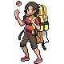

# Mt. Pyre — Trainer Pokémon

## [ 1F / 2F ]

### Trainer Rosters

### Rematches

| Trainer | P1 | P2 | P3 | P4 |
|:-------:|:--:|:--:|:--:|:--:|
| ") Hex Maniac Valerie (7) [461] | 
 [Dusclops](../../pokemon/dusclops.md) Lv. 59
 | 
 [Cofagrigus](../../pokemon/cofagrigus.md) Lv. 59
 | 
 [Chandelure](../../pokemon/chandelure.md) Lv. 59
 | 
 [Gourgeist](../../pokemon/gourgeist-average.md) Lv. 59
 |
| ") Hex Maniac Valerie (8) [462] | 
 [Dusknoir](../../pokemon/dusknoir.md) Lv. 64
 | 
 [Cofagrigus](../../pokemon/cofagrigus.md) Lv. 64
 | 
 [Chandelure](../../pokemon/chandelure.md) Lv. 64
 | 
 [Gourgeist](../../pokemon/gourgeist-average.md) Lv. 64
 |
| ") Hex Maniac Valerie (C) [463] | 
 [Dusknoir](../../pokemon/dusknoir.md) Lv. 75
 | 
 [Cofagrigus](../../pokemon/cofagrigus.md) Lv. 75
 | 
 [Chandelure](../../pokemon/chandelure.md) Lv. 75
 | 
 [Gourgeist](../../pokemon/gourgeist-average.md) Lv. 75
 |
| ") Fairy Tale Girl Momo (7) [770] | 
 [Wigglytuff](../../pokemon/wigglytuff.md) Lv. 59
 | 
 [Clefable](../../pokemon/clefable.md) Lv. 59
 | 
 [Aromatisse](../../pokemon/aromatisse.md) Lv. 59
 | 
 [Slurpuff](../../pokemon/slurpuff.md) Lv. 59
 |
| ") Fairy Tale Girl Momo (8) [771] | 
 [Wigglytuff](../../pokemon/wigglytuff.md) Lv. 64
 | 
 [Clefable](../../pokemon/clefable.md) Lv. 64
 | 
 [Aromatisse](../../pokemon/aromatisse.md) Lv. 64
 | 
 [Slurpuff](../../pokemon/slurpuff.md) Lv. 64
 |
| ") Fairy Tale Girl Momo (C) [772] | 
 [Wigglytuff](../../pokemon/wigglytuff.md) Lv. 75
 | 
 [Clefable](../../pokemon/clefable.md) Lv. 75
 | 
 [Aromatisse](../../pokemon/aromatisse.md) Lv. 75
 | 
 [Slurpuff](../../pokemon/slurpuff.md) Lv. 75
 |

## [ 3F / 4F ]

### Trainer Rosters

| Trainer | P1 | P2 | P3 |
|:-------:|:--:|:--:|:--:|
|  Mysterious Sisters Elle & Aya [781] | 
 [Florges](../../pokemon/florges.md) Lv. 51
 | 
 [Gourgeist](../../pokemon/gourgeist-average.md) Lv. 52
 |
|  Hex Maniac Tasha [331] | 
 [Trevenant](../../pokemon/trevenant.md) Lv. 50
 | 
 [Chandelure](../../pokemon/chandelure.md) Lv. 50
 |
|  Backpacker Darnell [723] | 
 [Dugtrio](../../pokemon/dugtrio.md) Lv. 49
 | 
 [Abomasnow](../../pokemon/abomasnow.md) Lv. 49
 | 
 [Girafarig](../../pokemon/girafarig.md) Lv. 49
 |

## [ Summit 2 ]

### Trainer Rosters

### Special Battles

| Trainer | P1 | P2 | P3 | P4 |
|:-------:|:--:|:--:|:--:|:--:|

