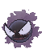
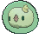
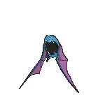
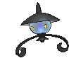
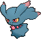

# Mt. Pyre — Wild Pokémon

## [ 1F / 2F ]

### Grass

| Sprite | Pokémon | Encounter Type | Chance |
|:------:|---------|:--------------:|--------|
|  | [Zubat](../../pokemon/zubat.md/) Lv. 40 |  Grass | 10% |
|  | [Gastly](../../pokemon/gastly.md/) Lv. 40 |  Grass | 10% |
|  | [Ralts](../../pokemon/ralts.md/) Lv. 40 |  Grass | 10% |
|  | [Shuppet](../../pokemon/shuppet.md/) Lv. 40 |  Grass | 10% |
|  | [Duskull](../../pokemon/duskull.md/) Lv. 40 |  Grass | 10% |
|  | [Gothita](../../pokemon/gothita.md/) Lv. 40 |  Grass | 10% |
|  | [Solosis](../../pokemon/solosis.md/) Lv. 40 |  Grass | 10% |
|  | [Yamask](../../pokemon/yamask.md/) Lv. 40 |  Grass | 10% |
|  | [Elgyem](../../pokemon/elgyem.md/) Lv. 40 |  Grass | 10% |
|  | [Litwick](../../pokemon/litwick.md/) Lv. 40 |  Grass | 10% |

### Horde

| Sprite | Pokémon | Encounter Type | Chance |
|:------:|---------|:--------------:|--------|
|  | [Gastly](../../pokemon/gastly.md/) Lv. 25 |  Horde | 100% |

## [ 3F / 4F ]

### Grass

| Sprite | Pokémon | Encounter Type | Chance |
|:------:|---------|:--------------:|--------|
|  | [Golbat](../../pokemon/golbat.md/) Lv. 45 |  Grass | 10% |
|  | [Haunter](../../pokemon/haunter.md/) Lv. 45 |  Grass | 10% |
|  | [Kirlia](../../pokemon/kirlia.md/) Lv. 45 |  Grass | 10% |
|  | [Banette](../../pokemon/banette.md/) Lv. 45 |  Grass | 10% |
|  | [Dusclops](../../pokemon/dusclops.md/) Lv. 45 |  Grass | 10% |
|  | [Gothorita](../../pokemon/gothorita.md/) Lv. 45 |  Grass | 10% |
|  | [Duosion](../../pokemon/duosion.md/) Lv. 45 |  Grass | 10% |
|  | [Cofagrigus](../../pokemon/cofagrigus.md/) Lv. 45 |  Grass | 10% |
|  | [Beheeyem](../../pokemon/beheeyem.md/) Lv. 45 |  Grass | 10% |
|  | [Lampent](../../pokemon/lampent.md/) Lv. 45 |  Grass | 10% |

### Horde

| Sprite | Pokémon | Encounter Type | Chance |
|:------:|---------|:--------------:|--------|
|  | [Haunter](../../pokemon/haunter.md/) Lv. 30 |  Horde | 100% |

## [ Summit 1 ]

### Grass

| Sprite | Pokémon | Encounter Type | Chance |
|:------:|---------|:--------------:|--------|
|  | [Spearow](../../pokemon/spearow.md/) Lv. 40 |  Grass | 10% |
|  | [Vulpix](../../pokemon/vulpix.md/) Lv. 40 |  Grass | 10% |
|  | [Growlithe](../../pokemon/growlithe.md/) Lv. 40 |  Grass | 10% |
|  | [Hoothoot](../../pokemon/hoothoot.md/) Lv. 40 |  Grass | 10% |
|  | [Natu](../../pokemon/natu.md/) Lv. 40 |  Grass | 10% |
|  | [Murkrow](../../pokemon/murkrow.md/) Lv. 40 |  Grass | 10% |
|  | [Misdreavus](../../pokemon/misdreavus.md/) Lv. 40 |  Grass | 10% |
|  | [Meditite](../../pokemon/meditite.md/) Lv. 40 |  Grass | 10% |
|  | [Bronzor](../../pokemon/bronzor.md/) Lv. 40 |  Grass | 10% |
|  | [Chingling](../../pokemon/chingling.md/) Lv. 40 |  Grass | 10% |

### DexNav

| Sprite | Pokémon | Encounter Type | Chance |
|:------:|---------|:--------------:|--------|
|  | [Mismagius](../../pokemon/mismagius.md/) Lv. 50 |  DexNav | 100% |

### Horde

| Sprite | Pokémon | Encounter Type | Chance |
|:------:|---------|:--------------:|--------|
|  | [Bronzor](../../pokemon/bronzor.md/) Lv. 25 |  Horde | 100% |

## [ Summit 2 ]

### Grass

| Sprite | Pokémon | Encounter Type | Chance |
|:------:|---------|:--------------:|--------|
|  | [Fearow](../../pokemon/fearow.md/) Lv. 45 |  Grass | 10% |
|  | [Vulpix](../../pokemon/vulpix.md/) Lv. 45 |  Grass | 10% |
|  | [Growlithe](../../pokemon/growlithe.md/) Lv. 45 |  Grass | 10% |
|  | [Noctowl](../../pokemon/noctowl.md/) Lv. 45 |  Grass | 10% |
|  | [Xatu](../../pokemon/xatu.md/) Lv. 45 |  Grass | 10% |
|  | [Murkrow](../../pokemon/murkrow.md/) Lv. 45 |  Grass | 10% |
|  | [Misdreavus](../../pokemon/misdreavus.md/) Lv. 45 |  Grass | 10% |
|  | [Medicham](../../pokemon/medicham.md/) Lv. 45 |  Grass | 10% |
|  | [Chimecho](../../pokemon/chimecho.md/) Lv. 45 |  Grass | 10% |
|  | [Bronzong](../../pokemon/bronzong.md/) Lv. 45 |  Grass | 10% |

### DexNav

| Sprite | Pokémon | Encounter Type | Chance |
|:------:|---------|:--------------:|--------|
|  | [Ninetales](../../pokemon/ninetales.md/) Lv. 50 |  DexNav | 100% |

### Horde

| Sprite | Pokémon | Encounter Type | Chance |
|:------:|---------|:--------------:|--------|
|  | [Bronzor](../../pokemon/bronzor.md/) Lv. 30 |  Horde | 100% |

