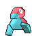

# New Mauville — Wild Pokémon

### Grass

| Sprite | Pokémon | Encounter Type | Chance |
|:------:|---------|:--------------:|--------|
|  | [Pikachu](../../pokemon/pikachu.md/) Lv. 35 |  Grass | 10% |
|  | [Magneton](../../pokemon/magneton.md/) Lv. 35 |  Grass | 10% |
|  | [Muk](../../pokemon/muk.md/) Lv. 35 |  Grass | 10% |
|  | [Electrode](../../pokemon/electrode.md/) Lv. 35 |  Grass | 10% |
|  | [Weezing](../../pokemon/weezing.md/) Lv. 35 |  Grass | 10% |
|  | [Electabuzz](../../pokemon/electabuzz.md/) Lv. 35 |  Grass | 10% |
|  | [Porygon](../../pokemon/porygon.md/) Lv. 35 |  Grass | 10% |
|  | [Rotom](../../pokemon/rotom.md/) Lv. 35 |  Grass | 10% |
|  | [Garbodor](../../pokemon/garbodor.md/) Lv. 35 |  Grass | 10% |
|  | [Klang](../../pokemon/klang.md/) Lv. 35 |  Grass | 10% |
|  | [Eelektrik](../../pokemon/eelektrik.md/) Lv. 35 |  Grass | 10% |

### Horde

| Sprite | Pokémon | Encounter Type | Chance |
|:------:|---------|:--------------:|--------|
|  | [Klink](../../pokemon/klink.md/) Lv. 23 |  Horde | 50% |
|  | [Tynamo](../../pokemon/tynamo.md/) Lv. 23 |  Horde | 50% |

