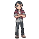
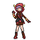
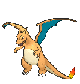

# Petalburg City — Special Battles

---

## [ Gym ]

### Norman

| Pokémon | Attributes | Item | Moves |
|:-------:|------------|:----:|-------|
|  | **Lv. 40** [Ambipom](../../pokemon/ambipom.md) **Ability:** Technician  |  Normal Gem | 1. Fake Out 2. Double Hit 3. Acrobatics 4. Knock Off |
|  | **Lv. 40** [Exploud](../../pokemon/exploud.md) **Ability:** Scrappy  |  Wise Glasses | 1. Boomburst 2. Flamethrower 3. Ice Beam 4. Thunderbolt |
|  | **Lv. 40** [Staraptor](../../pokemon/staraptor.md) **Ability:** Intimidate   |  Power Herb | 1. Retaliate 2. Close Combat 3. U-turn 4. Sky Attack |
|  | **Lv. 40** [Sawsbuck](../../pokemon/sawsbuck.md) **Ability:** Sap Sipper   |  Assault Vest | 1. Retaliate 2. Horn Leech 3. Jump Kick 4. Megahorn |
|  | **Lv. 40** [Bouffalant](../../pokemon/bouffalant.md) **Ability:** Sap Sipper  |  Silk Scarf | 1. Head Charge 2. Zen Headbutt 3. Megahorn 4. Revenge |
|  | **Lv. 42** [Slaking](../../pokemon/slaking.md) **Ability:** Truant  |  Sitrus Berry | 1. Retaliate 2. Rock Slide 3. Play Rough 4. Slack Off |

---

## [ Main Area (Postgame) ]

### Courtney

| Pokémon | Attributes | Item | Moves |
|:-------:|------------|:----:|-------|
|  | **Lv. 75** [Rapidash](../../pokemon/rapidash.md) **Ability:** Flame Body  |  Power Herb | 1. Flare Blitz 2. Megahorn 3. Bounce 4. Wild Charge |
|  | **Lv. 75** [Pyroar](../../pokemon/pyroar.md) **Ability:** Rivalry   |  Silk Scarf | 1. Hyper Voice 2. Flamethrower 3. Dark Pulse 4. Attract |
|  | **Lv. 75** [Rhyperior](../../pokemon/rhyperior.md) **Ability:** Solid Rock   |  Hard Stone | 1. Rock Wrecker 2. Earthquake 3. Megahorn 4. Poison Jab |
|  | **Lv. 75** [Camerupt](../../pokemon/camerupt.md) **Ability:** Solid Rock   |  Focus Sash | 1. Overheat 2. Earthquake 3. Explosion 4. Stone Edge |
|  | **Lv. 75** [Nidoking](../../pokemon/nidoking.md) **Ability:** Sheer Force   |  Life Orb | 1. Sludge Wave 2. Earth Power 3. Thunder 4. Fire Blast |
|  | **Lv. 77** [Charizard](../../pokemon/charizard.md) **Ability:** Blaze   |  Charizardite Y | 1. Fire Blast 2. Air Slash 3. Solar Beam 4. Focus Blast |

### Matt

| Pokémon | Attributes | Item | Moves |
|:-------:|------------|:----:|-------|
|  | **Lv. 75** [Golduck](../../pokemon/golduck.md) **Ability:** Damp  |  Wide Lens | 1. Hydro Pump 2. Focus Blast 3. Ice Beam 4. Psychic |
|  | **Lv. 75** [Barbaracle](../../pokemon/barbaracle.md) **Ability:** Tough Claws   |  Assault Vest | 1. Razor Shell 2. X-Scissor 3. Cross Chop 4. Stone Edge |
|  | **Lv. 75** [Ferrothorn](../../pokemon/ferrothorn.md) **Ability:** Iron Barbs   |  Rocky Helmet | 1. Iron Head 2. Power Whip 3. Payback 4. Thunder Wave |
|  | **Lv. 75** [Sharpedo](../../pokemon/sharpedo.md) **Ability:** Speed Boost   |  Focus Sash | 1. Hydro Pump 2. Crunch 3. Earthquake 4. Protect |
|  | **Lv. 75** [Nidoqueen](../../pokemon/nidoqueen.md) **Ability:** Sheer Force   |  Life Orb | 1. Sludge Wave 2. Earth Power 3. Thunder 4. Blizzard |
|  | **Lv. 77** [Blastoise](../../pokemon/blastoise.md) **Ability:** Torrent  |  Blastoisinite | 1. Hydro Pump 2. Aura Sphere 3. Dark Pulse 4. Blizzard |

