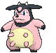
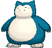
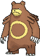
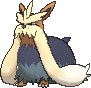
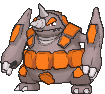
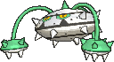

## [ Gym ]

### Generic Trainers

| Trainer | P1 | P2 | P3 | P4 | P5 | P6 |
|:-------:|:--:|:--:|:--:|:--:|:--:|:--:|
|  Ace Trainer Randall [063] | 
 [Persian](../../pokemon/persian.md) Lv. 37
 | 
 [Raticate](../../pokemon/raticate.md) Lv. 37
 | 
 [Lopunny](../../pokemon/lopunny.md) Lv. 37
 |
|  Ace Trainer Mary [067] | 
 [Delcatty](../../pokemon/delcatty.md) Lv. 37
 | 
 [Audino](../../pokemon/audino.md) Lv. 37
 | 
 [Porygon2](../../pokemon/porygon2.md) Lv. 37
 |
|  Ace Trainer Parker [064] | 
 [Girafarig](../../pokemon/girafarig.md) Lv. 37
 | 
 [Dunsparce](../../pokemon/dunsparce.md) Lv. 37
 | 
 [Stantler](../../pokemon/stantler.md) Lv. 37
 |
|  Ace Trainer Lori [068] | 
 [Tauros](../../pokemon/tauros.md) Lv. 37
 | 
 [Miltank](../../pokemon/miltank.md) Lv. 37
 | 
 [Furfrou](../../pokemon/furfrou.md) Lv. 37
 |
|  Ace Trainer George [065] | 
 [Chansey](../../pokemon/chansey.md) Lv. 37
 | 
 [Snorlax](../../pokemon/snorlax.md) Lv. 37
 | 
 [Blissey](../../pokemon/blissey.md) Lv. 37
 |
|  Ace Trainer Jody [069] | 
 [Ursaring](../../pokemon/ursaring.md) Lv. 37
 | 
 [Stoutland](../../pokemon/stoutland.md) Lv. 37
 | 
 [Kangaskhan](../../pokemon/kangaskhan.md) Lv. 37
 |
|  Ace Trainer Berke [066] | 
 [Purugly](../../pokemon/purugly.md) Lv. 37
 | 
 [Smeargle](../../pokemon/smeargle.md) Lv. 37
 | 
 [Lickilicky](../../pokemon/lickilicky.md) Lv. 37
 |
|  Leader Norman [570] | 
 [Ambipom](../../pokemon/ambipom.md) Lv. 40
 | 
 [Exploud](../../pokemon/exploud.md) Lv. 40
 | 
 [Staraptor](../../pokemon/staraptor.md) Lv. 40
 | 
 [Sawsbuck](../../pokemon/sawsbuck.md) Lv. 40
 | 
 [Bouffalant](../../pokemon/bouffalant.md) Lv. 40
 | 
 [Slaking](../../pokemon/slaking.md) Lv. 42
 |

## [ Main Area (Postgame) ]

### Generic Trainers

| Trainer | P1 | P2 | P3 | P4 | P5 | P6 |
|:-------:|:--:|:--:|:--:|:--:|:--:|:--:|
|  Magma Admin Courtney [697] | 
 [Rapidash](../../pokemon/rapidash.md) Lv. 75
 | 
 [Pyroar](../../pokemon/pyroar.md) Lv. 75
 | 
 [Rhyperior](../../pokemon/rhyperior.md) Lv. 75
 | 
 [Camerupt](../../pokemon/camerupt.md) Lv. 75
 | 
 [Nidoking](../../pokemon/nidoking.md) Lv. 75
 | 
 [Charizard](../../pokemon/charizard.md) Lv. 77
 |
|  Aqua Admin Matt [686] | 
 [Golduck](../../pokemon/golduck.md) Lv. 75
 | 
 [Barbaracle](../../pokemon/barbaracle.md) Lv. 75
 | 
 [Ferrothorn](../../pokemon/ferrothorn.md) Lv. 75
 | 
 [Sharpedo](../../pokemon/sharpedo.md) Lv. 75
 | 
 [Nidoqueen](../../pokemon/nidoqueen.md) Lv. 75
 | 
 [Blastoise](../../pokemon/blastoise.md) Lv. 77
 |

