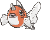

# Petalburg City — Wild Pokémon

### Surfing

| Sprite | Pokémon | Encounter Type | Chance |
|:------:|---------|:--------------:|--------|
|  | [Marill](../../pokemon/marill.md/) Lv. 25 - 35 |  Surfing | 50% |
|  | [Azumarill](../../pokemon/azumarill.md/) Lv. 25 - 35 |  Surfing | 50% |

### Old Rod

| Sprite | Pokémon | Encounter Type | Chance |
|:------:|---------|:--------------:|--------|
|  | [Goldeen](../../pokemon/goldeen.md/) Lv. 15 |  Old Rod | 100% |

### Good Rod

| Sprite | Pokémon | Encounter Type | Chance |
|:------:|---------|:--------------:|--------|
|  | [Goldeen](../../pokemon/goldeen.md/) Lv. 35 |  Good Rod | 100% |

### Super Rod

| Sprite | Pokémon | Encounter Type | Chance |
|:------:|---------|:--------------:|--------|
|  | [Seaking](../../pokemon/seaking.md/) Lv. 55 |  Super Rod | 100% |

