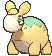
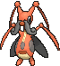

# Petalburg Woods — Trainer Pokémon

---

## [ Main Area ]

### Trainer Rosters

| Trainer | P1 | P2 | P3 |
|:-------:|:--:|:--:|:--:|
|  Bug Catcher Lyle [009] | 
 [Venonat](../../pokemon/venonat.md) Lv. 10
 | 
 [Venipede](../../pokemon/venipede.md) Lv. 10
 | 
 [Sewaddle](../../pokemon/sewaddle.md) Lv. 10
 |
|  Team Aqua Grunt [020] | 
 [Purrloin](../../pokemon/purrloin.md) Lv. 11
 | 
 [Carvanha](../../pokemon/carvanha.md) Lv. 11
 |
|  Team Magma Grunt [247] | 
 [Poochyena](../../pokemon/poochyena.md) Lv. 11
 | 
 [Numel](../../pokemon/numel.md) Lv. 11
 |
|  Bug Catcher James [302] | 
 [Nincada](../../pokemon/nincada.md) Lv. 10
 | 
 [Kricketot](../../pokemon/kricketot.md) Lv. 10
 | 
 [Surskit](../../pokemon/surskit.md) Lv. 10
 |

### Rematches

| Trainer | P1 | P2 | P3 | P4 |
|:-------:|:--:|:--:|:--:|:--:|
| ") Bug Catcher James (1) [477] | 
 [Nincada](../../pokemon/nincada.md) Lv. 13
 | 
 [Surskit](../../pokemon/surskit.md) Lv. 13
 | 
 [Kricketune](../../pokemon/kricketune.md) Lv. 13
 |
| ") Bug Catcher James (2) [478] | 
 [Nincada](../../pokemon/nincada.md) Lv. 16
 | 
 [Surskit](../../pokemon/surskit.md) Lv. 16
 | 
 [Kricketune](../../pokemon/kricketune.md) Lv. 16
 |
| ") Bug Catcher James (4) [479] | 
 [Ninjask](../../pokemon/ninjask.md) Lv. 35
 | 
 [Shedinja](../../pokemon/shedinja.md) Lv. 35
 | 
 [Masquerain](../../pokemon/masquerain.md) Lv. 35
 | 
 [Kricketune](../../pokemon/kricketune.md) Lv. 35
 |
| ") Bug Catcher James (C) [480] | 
 [Ninjask](../../pokemon/ninjask.md) Lv. 75
 | 
 [Shedinja](../../pokemon/shedinja.md) Lv. 75
 | 
 [Masquerain](../../pokemon/masquerain.md) Lv. 75
 | 
 [Kricketune](../../pokemon/kricketune.md) Lv. 75
 |

