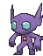
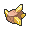

# Pokémon League — Special Battles

---

## [ R1 ]

### Sidney (R1)

")

| Pokémon | Attributes | Item | Moves |
|:-------:|------------|:----:|-------|
|  | **Lv. 70** [Weavile](../../pokemon/weavile.md) **Ability:** Pressure   |  Life Orb | 1. Icicle Crash 2. Knock Off 3. Low Kick 4. Poison Jab |
|  | **Lv. 70** [Scrafty](../../pokemon/scrafty.md) **Ability:** Intimidate   |  Leftovers | 1. High Jump Kick 2. Knock Off 3. Iron Head 4. Head Smash |
|  | **Lv. 70** [Bisharp](../../pokemon/bisharp.md) **Ability:** Defiant   |  Focus Sash | 1. Sucker Punch 2. Iron Head 3. Stone Edge 4. Thunder Wave |
|  | **Lv. 70** [Tyranitar](../../pokemon/tyranitar.md) **Ability:** Sand Stream   |  Assault Vest | 1. Stone Edge 2. Crunch 3. Ice Punch 4. Superpower |
|  | **Lv. 70** [Greninja](../../pokemon/greninja.md) **Ability:** Protean   |  Expert Belt | 1. Dark Pulse 2. Hydro Pump 3. Ice Beam 4. Gunk Shot |
|  | **Lv. 72** [Absol](../../pokemon/absol.md) **Ability:** Super Luck  |  Absolite | 1. Sucker Punch 2. Play Rough 3. Fire Blast 4. Iron Tail |

### Phoebe (R1)

")

| Pokémon | Attributes | Item | Moves |
|:-------:|------------|:----:|-------|
|  | **Lv. 71** [Mismagius](../../pokemon/mismagius.md) **Ability:** Levitate   |  Wise Glasses | 1. Shadow Ball 2. Moonblast 3. Thunderbolt 4. Thunder Wave |
|  | **Lv. 71** [Gengar](../../pokemon/gengar.md) **Ability:** Levitate   |  Expert Belt | 1. Shadow Ball 2. Sludge Wave 3. Focus Blast 4. Hypnosis |
|  | **Lv. 71** [Gourgeist](../../pokemon/gourgeist-average.md) **Ability:** Insomnia   |  Assault Vest | 1. Petal Blizzard 2. Phantom Force 3. Rock Slide 4. Fire Blast |
|  | **Lv. 71** [Chandelure](../../pokemon/chandelure.md) **Ability:** Flame Body   |  Choice Scarf | 1. Fire Blast 2. Shadow Ball 3. Energy Ball 4. Trick |
|  | **Lv. 71** [Dusknoir](../../pokemon/dusknoir.md) **Ability:** Pressure  |  Life Orb | 1. Phantom Force 2. Earthquake 3. Rock Slide 4. Ice Punch |
|  | **Lv. 73** [Sableye](../../pokemon/sableye.md) **Ability:** Prankster   |  Sablenite | 1. Knock Off 2. Recover 3. Will-O-Wisp 4. Metal Burst |

### Glacia (R1)

")

| Pokémon | Attributes | Item | Moves |
|:-------:|------------|:----:|-------|
|  | **Lv. 72** [Aurorus](../../pokemon/aurorus.md) **Ability:** Snow Warning   |  Icy Rock | 1. Blizzard 2. Earth Power 3. Freeze-Dry 4. Thunderbolt |
|  | **Lv. 72** [Froslass](../../pokemon/froslass.md) **Ability:** Snow Cloak   |  Life Orb | 1. Shadow Ball 2. Thunderbolt 3. Blizzard 4. Destiny Bond |
|  | **Lv. 72** [Jynx](../../pokemon/jynx.md) **Ability:** Dry Skin   |  Focus Sash | 1. Lovely Kiss 2. Blizzard 3. Psychic 4. Focus Blast |
|  | **Lv. 72** [Mamoswine](../../pokemon/mamoswine.md) **Ability:** Thick Fat   |  Choice Scarf | 1. Icicle Crash 2. Earthquake 3. Stone Edge 4. Superpower |
|  | **Lv. 72** [Walrein](../../pokemon/walrein.md) **Ability:** Ice Body   |  Leftovers | 1. Surf 2. Blizzard 3. Hail 4. Protect |
|  | **Lv. 74** [Glalie](../../pokemon/glalie.md) **Ability:** Moody  |  Glalitite | 1. Double-Edge 2. Freeze-Dry 3. Earthquake 4. Ice Shard |

### Drake (R1)

")

| Pokémon | Attributes | Item | Moves |
|:-------:|------------|:----:|-------|
|  | **Lv. 73** [Hydreigon](../../pokemon/hydreigon.md) **Ability:** Levitate   |  Life Orb | 1. Draco Meteor 2. Dark Pulse 3. Flash Cannon 4. Focus Blast |
|  | **Lv. 73** [Flygon](../../pokemon/flygon.md) **Ability:** Levitate   |  Choice Scarf | 1. Outrage 2. Earthquake 3. U-turn 4. Iron Tail |
|  | **Lv. 73** [Haxorus](../../pokemon/haxorus.md) **Ability:** Mold Breaker  |  Roseli Berry | 1. Dragon Dance 2. Outrage 3. Earthquake 4. Poison Jab |
|  | **Lv. 73** [Kingdra](../../pokemon/kingdra.md) **Ability:** Sniper   |  Scope Lens | 1. Hydro Pump 2. Ice Beam 3. Draco Meteor 4. Flash Cannon |
|  | **Lv. 73** [Dragalge](../../pokemon/dragalge.md) **Ability:** Adaptability   |  Choice Specs | 1. Sludge Wave 2. Draco Meteor 3. Focus Blast 4. Thunder |
|  | **Lv. 75** [Salamence](../../pokemon/salamence.md) **Ability:** Intimidate   |  Salamencite | 1. Dragon Rush 2. Body Slam 3. Fire Blast 4. Earthquake |

### Steven (R1)

")

| Pokémon | Attributes | Item | Moves |
|:-------:|------------|:----:|-------|
|  | **Lv. 77** [Skarmory](../../pokemon/skarmory.md) **Ability:** Sturdy   |  Smooth Rock | 1. Sandstorm 2. Stealth Rock 3. Roost 4. Brave Bird |
|  | **Lv. 77** [Aggron](../../pokemon/aggron.md) **Ability:** Rock Head   |  Focus Sash | 1. Head Smash 2. Heavy Slam 3. Earthquake 4. Thunder Wave |
|  | **Lv. 77** [Claydol](../../pokemon/claydol.md) **Ability:** Levitate   |  Light Clay | 1. Reflect 2. Light Screen 3. Earthquake 4. Psychic |
|  | **Lv. 77** [Aerodactyl](../../pokemon/aerodactyl.md) **Ability:** Rock Head   |  Life Orb | 1. Stone Edge 2. Earthquake 3. Aqua Tail 4. Brave Bird |
|  | **Lv. 77** [Diancie](../../pokemon/diancie.md) **Ability:** Clear Body   |  Assault Vest | 1. Diamond Storm 2. Moonblast 3. Earth Power 4. Reflect |
|  | **Lv. 79** [Metagross](../../pokemon/metagross.md) **Ability:** Clear Body   |  Metagrossite | 1. Meteor Mash 2. Earthquake 3. Zen Headbutt 4. Hammer Arm |

---

## [ R2 (Postgame) ]

### Sidney (R2)

")

| Pokémon | Attributes | Item | Moves |
|:-------:|------------|:----:|-------|
|  | **Lv. 80** [Scrafty](../../pokemon/scrafty.md) **Ability:** Intimidate   |  Assault Vest | 1. High Jump Kick 2. Knock Off 3. Head Smash 4. Iron Head |
|  | **Lv. 80** [Bisharp](../../pokemon/bisharp.md) **Ability:** Defiant   |  Focus Sash | 1. Knock Off 2. Iron Head 3. Sucker Punch 4. Swords Dance |
|  | **Lv. 80** [Darkrai](../../pokemon/darkrai.md) **Ability:** Bad Dreams  |  Life Orb | 1. Dark Void 2. Dark Pulse 3. Ice Beam 4. Sludge Bomb |
|  | **Lv. 80** [Greninja](../../pokemon/greninja.md) **Ability:** Protean   |  Expert Belt | 1. Ice Beam 2. Dark Pulse 3. Gunk Shot 4. Hydro Pump |
|  | **Lv. 82** [Absol](../../pokemon/absol.md) **Ability:** Super Luck  |  Scope Lens | 1. Night Slash 2. Play Rough 3. Psycho Cut 4. Megahorn |
|  | **Lv. 82** [Tyranitar](../../pokemon/tyranitar.md) **Ability:** Sand Stream   |  Tyranitarite | 1. Dragon Dance 2. Stone Edge 3. Crunch 4. Ice Punch |

### Phoebe (R2)

")

| Pokémon | Attributes | Item | Moves |
|:-------:|------------|:----:|-------|
|  | **Lv. 81** [Aegislash](../../pokemon/aegislash-shield.md) **Ability:** Stance Change   |  Weakness Policy | 1. King's Shield 2. Shadow Ball 3. Flash Cannon 4. Sacred Sword |
|  | **Lv. 81** [Chandelure](../../pokemon/chandelure.md) **Ability:** Flame Body   |  Choice Scarf | 1. Fire Blast 2. Shadow Ball 3. Energy Ball 4. Trick |
|  | **Lv. 81** [Hoopa](../../pokemon/hoopa.md) **Ability:** Magician   |  Life Orb | 1. Shadow Ball 2. Hyperspace Hole 3. Focus Blast 4. Thunder |
|  | **Lv. 81** [Dusknoir](../../pokemon/dusknoir.md) **Ability:** Pressure  |  Choice Band | 1. Phantom Force 2. Earthquake 3. Rock Slide 4. Ice Punch |
|  | **Lv. 83** [Sableye](../../pokemon/sableye.md) **Ability:** Prankster   |  Leftovers | 1. Recover 2. Toxic 3. Protect 4. Foul Play |
|  | **Lv. 82** [Gengar](../../pokemon/gengar.md) **Ability:** Levitate   |  Gengarite | 1. Shadow Ball 2. Sludge Wave 3. Focus Blast 4. Hypnosis |

### Glacia (R2)

")

| Pokémon | Attributes | Item | Moves |
|:-------:|------------|:----:|-------|
|  | **Lv. 82** [Walrein](../../pokemon/walrein.md) **Ability:** Ice Body   |  Icy Rock | 1. Surf 2. Blizzard 3. Protect 4. Hail |
|  | **Lv. 82** [Froslass](../../pokemon/froslass.md) **Ability:** Snow Cloak   |  Bright Powder | 1. Shadow Ball 2. Thunderbolt 3. Blizzard 4. Destiny Bond |
|  | **Lv. 82** [Articuno](../../pokemon/articuno.md) **Ability:** Snow Cloak   |  Life Orb | 1. Blizzard 2. Hurricane 3. Freeze-Dry 4. Roost |
|  | **Lv. 82** [Mamoswine](../../pokemon/mamoswine.md) **Ability:** Thick Fat   |  Choice Scarf | 1. Icicle Crash 2. Earthquake 3. Stone Edge 4. Superpower |
|  | **Lv. 84** [Glalie](../../pokemon/glalie.md) **Ability:** Moody  |  Focus Sash | 1. Light Screen 2. Earthquake 3. Protect 4. Blizzard |
|  | **Lv. 84** [Abomasnow](../../pokemon/abomasnow.md) **Ability:** Snow Warning   |  Abomasite | 1. Blizzard 2. Wood Hammer 3. Ice Shard 4. Earthquake |

### Drake (R2)

")

| Pokémon | Attributes | Item | Moves |
|:-------:|------------|:----:|-------|
|  | **Lv. 83** [Hydreigon](../../pokemon/hydreigon.md) **Ability:** Levitate   |  White Herb | 1. Draco Meteor 2. Dark Pulse 3. Flash Cannon 4. Focus Blast |
|  | **Lv. 83** [Garchomp](../../pokemon/garchomp.md) **Ability:** Rough Skin   |  Focus Sash | 1. Swords Dance 2. Outrage 3. Earthquake 4. Stone Edge |
|  | **Lv. 83** [Latias](../../pokemon/latias.md) **Ability:** Levitate   |  Soul Dew | 1. Psychic 2. Ice Beam 3. Roost 4. Thunder Wave |
|  | **Lv. 83** [Kingdra](../../pokemon/kingdra.md) **Ability:** Sniper   |  Scope Lens | 1. Hydro Pump 2. Ice Beam 3. Draco Meteor 4. Flash Cannon |
|  | **Lv. 85** [Salamence](../../pokemon/salamence.md) **Ability:** Intimidate   |  Life Orb | 1. Outrage 2. Earthquake 3. Fire Blast 4. Hydro Pump |
|  | **Lv. 85** [Latios](../../pokemon/latios.md) **Ability:** Levitate   |  Latiosite | 1. Dragon Pulse 2. Psyshock 3. Earthquake 4. Roost |

### Steven (R2)

")

| Pokémon | Attributes | Item | Moves |
|:-------:|------------|:----:|-------|
|  | **Lv. 87** [Aerodactyl](../../pokemon/aerodactyl.md) **Ability:** Rock Head   |  Life Orb | 1. Stone Edge 2. Earthquake 3. Aqua Tail 4. Brave Bird |
|  | **Lv. 87** [Aggron](../../pokemon/aggron.md) **Ability:** Rock Head   |  Focus Sash | 1. Head Smash 2. Heavy Slam 3. Earthquake 4. Thunder Wave |
|  | **Lv. 87** [Heatran](../../pokemon/heatran.md) **Ability:** Flame Body   |  Air Balloon | 1. Magma Storm 2. Earth Power 3. Flash Cannon 4. Stone Edge |
|  | **Lv. 87** [Claydol](../../pokemon/claydol.md) **Ability:** Levitate   |  Light Clay | 1. Reflect 2. Light Screen 3. Earthquake 4. Psychic |
|  | **Lv. 87** [Metagross](../../pokemon/metagross.md) **Ability:** Clear Body   |  Assault Vest | 1. Meteor Mash 2. Earthquake 3. Zen Headbutt 4. Explosion |
|  | **Lv. 89** [Diancie](../../pokemon/diancie.md) **Ability:** Clear Body   |  Diancite | 1. Rock Polish 2. Diamond Storm 3. Moonblast 4. Earth Power |

