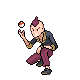
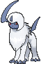
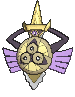
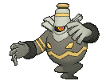
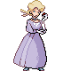
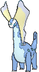
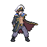
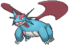
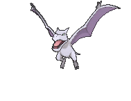
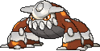

# Pokémon League — Trainer Pokémon

---

## [ R1 ]

### Trainer Rosters

| Trainer | P1 | P2 | P3 | P4 | P5 | P6 |
|:-------:|:--:|:--:|:--:|:--:|:--:|:--:|
|  Elite Four Sidney [553] | 
 [Weavile](../../pokemon/weavile.md) Lv. 70
 | 
 [Scrafty](../../pokemon/scrafty.md) Lv. 70
 | 
 [Bisharp](../../pokemon/bisharp.md) Lv. 70
 | 
 [Tyranitar](../../pokemon/tyranitar.md) Lv. 70
 | 
 [Greninja](../../pokemon/greninja.md) Lv. 70
 | 
 [Absol](../../pokemon/absol.md) Lv. 72
 |
|  Elite Four Phoebe [554] | 
 [Mismagius](../../pokemon/mismagius.md) Lv. 71
 | 
 [Gengar](../../pokemon/gengar.md) Lv. 71
 | 
 [Aegislash](../../pokemon/aegislash-shield.md) Lv. 71
 | 
 [Chandelure](../../pokemon/chandelure.md) Lv. 71
 | 
 [Dusknoir](../../pokemon/dusknoir.md) Lv. 71
 | 
 [Sableye](../../pokemon/sableye.md) Lv. 73
 |
|  Elite Four Glacia [555] | 
 [Aurorus](../../pokemon/aurorus.md) Lv. 72
 | 
 [Froslass](../../pokemon/froslass.md) Lv. 72
 | 
 [Jynx](../../pokemon/jynx.md) Lv. 72
 | 
 [Mamoswine](../../pokemon/mamoswine.md) Lv. 72
 | 
 [Walrein](../../pokemon/walrein.md) Lv. 72
 | 
 [Glalie](../../pokemon/glalie.md) Lv. 74
 |
|  Elite Four Drake [556] | 
 [Hydreigon](../../pokemon/hydreigon.md) Lv. 73
 | 
 [Flygon](../../pokemon/flygon.md) Lv. 73
 | 
 [Haxorus](../../pokemon/haxorus.md) Lv. 73
 | 
 [Kingdra](../../pokemon/kingdra.md) Lv. 73
 | 
 [Dragalge](../../pokemon/dragalge.md) Lv. 73
 | 
 [Salamence](../../pokemon/salamence.md) Lv. 75
 |
|  Champion Steven [557] | 
 [Skarmory](../../pokemon/skarmory.md) Lv. 77
 | 
 [Aggron](../../pokemon/aggron.md) Lv. 77
 | 
 [Claydol](../../pokemon/claydol.md) Lv. 77
 | 
 [Aerodactyl](../../pokemon/aerodactyl.md) Lv. 77
 | 
 [Diancie](../../pokemon/diancie.md) Lv. 77
 | 
 [Metagross](../../pokemon/metagross.md) Lv. 79
 |

### Special Battles

1. [Sidney (R1)]()

1. [Phoebe (R1)]()

1. [Glacia (R1)]()

1. [Drake (R1)]()

1. [Steven (R1)]()

---

## [ R2 (Postgame) ]

### Trainer Rosters

| Trainer | P1 | P2 | P3 | P4 | P5 | P6 |
|:-------:|:--:|:--:|:--:|:--:|:--:|:--:|
|  Elite Four Sidney [909] | 
 [Scrafty](../../pokemon/scrafty.md) Lv. 80
 | 
 [Bisharp](../../pokemon/bisharp.md) Lv. 80
 | 
 [Darkrai](../../pokemon/darkrai.md) Lv. 80
 | 
 [Greninja](../../pokemon/greninja.md) Lv. 80
 | 
 [Absol](../../pokemon/absol.md) Lv. 82
 | 
 [Tyranitar](../../pokemon/tyranitar.md) Lv. 82
 |
|  Elite Four Phoebe [910] | 
 [Aegislash](../../pokemon/aegislash-shield.md) Lv. 81
 | 
 [Chandelure](../../pokemon/chandelure.md) Lv. 81
 | 
 [Hoopa](../../pokemon/hoopa.md) Lv. 81
 | 
 [Dusknoir](../../pokemon/dusknoir.md) Lv. 81
 | 
 [Sableye](../../pokemon/sableye.md) Lv. 83
 | 
 [Gengar](../../pokemon/gengar.md) Lv. 83
 |
|  Elite Four Glacia [911] | 
 [Walrein](../../pokemon/walrein.md) Lv. 82
 | 
 [Froslass](../../pokemon/froslass.md) Lv. 82
 | 
 [Articuno](../../pokemon/articuno.md) Lv. 82
 | 
 [Mamoswine](../../pokemon/mamoswine.md) Lv. 82
 | 
 [Glalie](../../pokemon/glalie.md) Lv. 84
 | 
 [Abomasnow](../../pokemon/abomasnow.md) Lv. 84
 |
|  Elite Four Drake [912] | 
 [Hydreigon](../../pokemon/hydreigon.md) Lv. 83
 | 
 [Garchomp](../../pokemon/garchomp.md) Lv. 83
 | 
 [Latias](../../pokemon/latias.md) Lv. 83
 | 
 [Kingdra](../../pokemon/kingdra.md) Lv. 83
 | 
 [Salamence](../../pokemon/salamence.md) Lv. 85
 | 
 [Latios](../../pokemon/latios.md) Lv. 85
 |
|  Champion Steven [913] | 
 [Aerodactyl](../../pokemon/aerodactyl.md) Lv. 87
 | 
 [Aggron](../../pokemon/aggron.md) Lv. 87
 | 
 [Heatran](../../pokemon/heatran.md) Lv. 87
 | 
 [Claydol](../../pokemon/claydol.md) Lv. 87
 | 
 [Metagross](../../pokemon/metagross.md) Lv. 89
 | 
 [Diancie](../../pokemon/diancie.md) Lv. 89
 |

### Special Battles

1. [Sidney (R2)]()

1. [Phoebe (R2)]()

1. [Glacia (R2)]()

1. [Drake (R2)]()

1. [Steven (R2)]()

