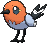

# Route 101 — Wild Pokémon

### Grass

| Sprite | Pokémon | Encounter Type | Level | Chance |
|:------:|---------|:--------------:|-------|--------|
|  | [Pidgey](../../pokemon/pidgey.md/) |  Grass | 5 | 10% |
|  | [Rattata](../../pokemon/rattata.md/) |  Grass | 5 | 10% |
|  | [Sentret](../../pokemon/sentret.md/) |  Grass | 5 | 10% |
|  | [Hoothoot](../../pokemon/hoothoot.md/) |  Grass | 5 | 10% |
|  | [Poochyena](../../pokemon/poochyena.md/) |  Grass | 5 | 10% |
|  | [Zigzagoon](../../pokemon/zigzagoon.md/) |  Grass | 5 | 10% |
|  | [Starly](../../pokemon/starly.md/) |  Grass | 5 | 10% |
|  | [Bidoof](../../pokemon/bidoof.md/) |  Grass | 5 | 10% |
|  | [Bunnelby](../../pokemon/bunnelby.md/) |  Grass | 5 | 10% |
|  | [Fletchling](../../pokemon/fletchling.md/) |  Grass | 5 | 10% |

### DexNav

| Sprite | Pokémon | Encounter Type | Level | Chance |
|:------:|---------|:--------------:|-------|--------|
|  | [Linoone](../../pokemon/linoone.md/) |  DexNav | 50 | 100% |

### Horde

| Sprite | Pokémon | Encounter Type | Level | Chance |
|:------:|---------|:--------------:|-------|--------|
|  | [Chikorita](../../pokemon/chikorita.md/) |  Horde | 5 | 50% |
|  | [Fennekin](../../pokemon/fennekin.md/) |  Horde | 5 | 50% |

