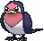
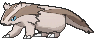

# Route 102 — Trainer Pokémon

---

## [ Main Area ]

### Trainer Rosters

| Trainer | P1 | P2 | P3 |
|:-------:|:--:|:--:|:--:|
|  Youngster Calvin [007] | 
 [Bunnelby](../../pokemon/bunnelby.md) Lv. 7
 | 
 [Sentret](../../pokemon/sentret.md) Lv. 7
 | 
 [Zigzagoon](../../pokemon/zigzagoon.md) Lv. 7
 |
|  Bug Catcher Rick [008] | 
 [Caterpie](../../pokemon/caterpie.md) Lv. 7
 | 
.") [Weedle](../../pokemon/weedle.md) Lv. 7
 | 
 [Wurmple](../../pokemon/wurmple.md) Lv. 7
 |
|  Youngster Allen [301] | 
 [Pidgey](../../pokemon/pidgey.md) Lv. 7
 | 
 [Taillow](../../pokemon/taillow.md) Lv. 7
 | 
 [Pidove](../../pokemon/pidove.md) Lv. 7
 |
|  Lass Tiana [010] | 
 [Bellsprout](../../pokemon/bellsprout.md) Lv. 7
 | 
 [Tympole](../../pokemon/tympole.md) Lv. 7
 | 
 [Gothita](../../pokemon/gothita.md) Lv. 7
 |

### Rematches

| Trainer | P1 | P2 | P3 | P4 |
|:-------:|:--:|:--:|:--:|:--:|
| ") Youngster Calvin (1) [195] | 
 [Zigzagoon](../../pokemon/zigzagoon.md) Lv. 13
 | 
 [Bidoof](../../pokemon/bidoof.md) Lv. 13
 | 
 [Sentret](../../pokemon/sentret.md) Lv. 13
 | 
 [Bunnelby](../../pokemon/bunnelby.md) Lv. 13
 |
| ") Youngster Calvin (3) [196] | 
 [Linoone](../../pokemon/linoone.md) Lv. 25
 | 
 [Bibarel](../../pokemon/bibarel.md) Lv. 25
 | 
 [Herdier](../../pokemon/herdier.md) Lv. 25
 | 
 [Diggersby](../../pokemon/diggersby.md) Lv. 25
 |
| ") Youngster Calvin (5) [197] | 
 [Linoone](../../pokemon/linoone.md) Lv. 39
 | 
 [Bibarel](../../pokemon/bibarel.md) Lv. 39
 | 
 [Stoutland](../../pokemon/stoutland.md) Lv. 39
 | 
 [Diggersby](../../pokemon/diggersby.md) Lv. 39
 |
| ") Youngster Calvin (C) [198] | 
 [Linoone](../../pokemon/linoone.md) Lv. 75
 | 
 [Bibarel](../../pokemon/bibarel.md) Lv. 75
 | 
 [Stoutland](../../pokemon/stoutland.md) Lv. 75
 | 
 [Diggersby](../../pokemon/diggersby.md) Lv. 75
 |

