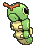

# Route 102 — Wild Pokémon

## [ Main Area ]

### Grass

| Sprite | Pokémon | Encounter | Chance |
|:------:|---------|:---------:|--------|
|  | [Caterpie](../../pokemon/caterpie.md/) Lv. 6 |  Grass | 10% |
| .") | [Weedle](../../pokemon/weedle.md/) Lv. 6 |  Grass | 10% |
|  | [Bellsprout](../../pokemon/bellsprout.md/) Lv. 6 |  Grass | 10% |
|  | [Wurmple](../../pokemon/wurmple.md/) Lv. 6 |  Grass | 10% |
|  | [Lotad](../../pokemon/lotad.md/) Lv. 6 |  Grass | 10% |
|  | [Seedot](../../pokemon/seedot.md/) Lv. 6 |  Grass | 10% |
|  | [Ralts*](../../pokemon/ralts.md/) Lv. 6 |  Grass | 5% |
|  | [Surskit*](../../pokemon/surskit.md/) Lv. 6 |  Grass | 5% |
|  | [Tympole](../../pokemon/tympole.md/) Lv. 6 |  Grass | 10% |
|  | [Gothita](../../pokemon/gothita.md/) Lv. 6 |  Grass | 10% |
|  | [Solosis](../../pokemon/solosis.md/) Lv. 6 |  Grass | 10% |

### DexNav

| Sprite | Pokémon | Encounter | Chance |
|:------:|---------|:---------:|--------|
|  | [Weepinbell](../../pokemon/weepinbell.md/) Lv. 50 |  DexNav | 100% |

### Horde

| Sprite | Pokémon | Encounter | Chance |
|:------:|---------|:---------:|--------|
|  | [Charmander](../../pokemon/charmander.md/) Lv. 6 |  Horde | 50% |
|  | [Chespin](../../pokemon/chespin.md/) Lv. 6 |  Horde | 50% |

### Surfing

| Sprite | Pokémon | Encounter | Chance |
|:------:|---------|:---------:|--------|
|  | [Surskit](../../pokemon/surskit.md/) Lv. 25 - 35 |  Surfing | 50% |
|  | [Masquerain](../../pokemon/masquerain.md/) Lv. 25 - 35 |  Surfing | 50% |

### Old Rod

| Sprite | Pokémon | Encounter | Chance |
|:------:|---------|:---------:|--------|
|  | [Corphish](../../pokemon/corphish.md/) Lv. 15 |  Old Rod | 100% |

### Good Rod

| Sprite | Pokémon | Encounter | Chance |
|:------:|---------|:---------:|--------|
|  | [Corphish](../../pokemon/corphish.md/) Lv. 35 |  Good Rod | 100% |

### Super Rod

| Sprite | Pokémon | Encounter | Chance |
|:------:|---------|:---------:|--------|
|  its shell regularly. Immediately after molting, its shell is soft and tender. Until the shell hardens, this Pokémon hides in its streambed burrow to avoid attack from its foes.") | [Crawdaunt](../../pokemon/crawdaunt.md/) Lv. 55 |  Super Rod | 100% |

