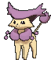

# Route 103 — Trainer Pokémon

### Trainer Rosters

### Rematches

| Trainer | P1 | P2 | P3 | P4 | P5 |
|:-------:|:--:|:--:|:--:|:--:|:--:|
| ") Twins Amy & Liv (4) [055] | 
 [Delcatty](../../pokemon/delcatty.md) Lv. 35
 | 
 [Lopunny](../../pokemon/lopunny.md) Lv. 35
 | 
 [Clefable](../../pokemon/clefable.md) Lv. 35
 | 
 [Wigglytuff](../../pokemon/wigglytuff.md) Lv. 35
 |
| ") Twins Amy & Liv (6) [368] | 
 [Delcatty](../../pokemon/delcatty.md) Lv. 47
 | 
 [Lopunny](../../pokemon/lopunny.md) Lv. 47
 | 
 [Clefable](../../pokemon/clefable.md) Lv. 47
 | 
 [Wigglytuff](../../pokemon/wigglytuff.md) Lv. 47
 |
| ") Twins Amy & Liv (7) [596] | 
 [Delcatty](../../pokemon/delcatty.md) Lv. 59
 | 
 [Lopunny](../../pokemon/lopunny.md) Lv. 59
 | 
 [Clefable](../../pokemon/clefable.md) Lv. 59
 | 
 [Wigglytuff](../../pokemon/wigglytuff.md) Lv. 59
 |
| ") Twins Amy & Liv (C) [597] | 
 [Delcatty](../../pokemon/delcatty.md) Lv. 75
 | 
 [Lopunny](../../pokemon/lopunny.md) Lv. 75
 | 
 [Clefable](../../pokemon/clefable.md) Lv. 75
 | 
 [Wigglytuff](../../pokemon/wigglytuff.md) Lv. 75
 |
| ") Poké Fan Miguel (4) [651] | 
 [Pikachu](../../pokemon/pikachu.md) Lv. 35
 | 
 [Pikachu](../../pokemon/pikachu.md) Lv. 35
 | 
 [Pikachu](../../pokemon/pikachu.md) Lv. 35
 | 
 [Pikachu](../../pokemon/pikachu.md) Lv. 35
 | 
 [Pikachu](../../pokemon/pikachu.md) Lv. 35
 |
| ") Poké Fan Miguel (5) [652] | 
 [Pikachu](../../pokemon/pikachu.md) Lv. 39
 | 
 [Pikachu](../../pokemon/pikachu.md) Lv. 39
 | 
 [Pikachu](../../pokemon/pikachu.md) Lv. 39
 | 
 [Pikachu](../../pokemon/pikachu.md) Lv. 39
 | 
 [Pikachu](../../pokemon/pikachu.md) Lv. 39
 |
| ") Poké Fan Miguel (6) [653] | 
 [Pikachu](../../pokemon/pikachu.md) Lv. 47
 | 
 [Pikachu](../../pokemon/pikachu.md) Lv. 47
 | 
 [Pikachu](../../pokemon/pikachu.md) Lv. 47
 | 
 [Pikachu](../../pokemon/pikachu.md) Lv. 47
 | 
 [Pikachu](../../pokemon/pikachu.md) Lv. 47
 |
| ") Poké Fan Miguel (C) [654] | 
 [Pikachu](../../pokemon/pikachu.md) Lv. 75
 | 
 [Pikachu](../../pokemon/pikachu.md) Lv. 75
 | 
 [Pikachu](../../pokemon/pikachu.md) Lv. 75
 | 
 [Pikachu](../../pokemon/pikachu.md) Lv. 75
 | 
 [Pikachu](../../pokemon/pikachu.md) Lv. 75
 |

