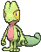
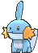
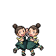
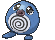

# Route 103 — Trainer Pokémon

---

## [ West of River ]

### Trainer Rosters

| Trainer | P1 |
|:-------:|:--:|
|  PKMN Trainer Brendan [001] | 
 [Treecko](../../pokemon/treecko.md) Lv. 5
 |
|  PKMN Trainer Brendan [002] | 
 [Torchic](../../pokemon/torchic.md) Lv. 5
 |
|  PKMN Trainer Brendan [003] | 
 [Mudkip](../../pokemon/mudkip.md) Lv. 5
 |
|  PKMN Trainer May [004] | 
 [Treecko](../../pokemon/treecko.md) Lv. 5
 |
|  PKMN Trainer May [005] | 
 [Torchic](../../pokemon/torchic.md) Lv. 5
 |
|  PKMN Trainer May [006] | 
 [Mudkip](../../pokemon/mudkip.md) Lv. 5
 |

### Special Battles

1. [Rival]()

---

## [ East of River ]

### Trainer Rosters

| Trainer | P1 | P2 | P3 | P4 | P5 |
|:-------:|:--:|:--:|:--:|:--:|:--:|
|  Aroma Lady Daisy [011] | 
 [Oddish](../../pokemon/oddish.md) Lv. 19
 | 
 [Cherubi](../../pokemon/cherubi.md) Lv. 19
 | 
 [Budew](../../pokemon/budew.md) Lv. 19
 |
|  Twins Amy & Liv [012] | 
 [Clefairy](../../pokemon/clefairy.md) Lv. 20
 | 
 [Jigglypuff](../../pokemon/jigglypuff.md) Lv. 20
 |
|  Poké Fan Miguel [644] | 
 [Pikachu](../../pokemon/pikachu.md) Lv. 18
 | 
 [Pikachu](../../pokemon/pikachu.md) Lv. 18
 | 
 [Pikachu](../../pokemon/pikachu.md) Lv. 18
 | 
 [Pikachu](../../pokemon/pikachu.md) Lv. 18
 | 
 [Pikachu](../../pokemon/pikachu.md) Lv. 18
 |
|  Fisherman Andrew [013] | 
 [Poliwag](../../pokemon/poliwag.md) Lv. 19
 | 
 [Skrelp](../../pokemon/skrelp.md) Lv. 19
 | 
 [Staryu](../../pokemon/staryu.md) Lv. 19
 |

### Rematches

| Trainer | P1 | P2 | P3 | P4 | P5 |
|:-------:|:--:|:--:|:--:|:--:|:--:|
| ") Twins Amy & Liv (4) [055] | 
 [Delcatty](../../pokemon/delcatty.md) Lv. 35
 | 
 [Lopunny](../../pokemon/lopunny.md) Lv. 35
 | 
 [Clefable](../../pokemon/clefable.md) Lv. 35
 | 
 [Wigglytuff](../../pokemon/wigglytuff.md) Lv. 35
 |
| ") Twins Amy & Liv (6) [368] | 
 [Delcatty](../../pokemon/delcatty.md) Lv. 47
 | 
 [Lopunny](../../pokemon/lopunny.md) Lv. 47
 | 
 [Clefable](../../pokemon/clefable.md) Lv. 47
 | 
 [Wigglytuff](../../pokemon/wigglytuff.md) Lv. 47
 |
| ") Twins Amy & Liv (7) [596] | 
 [Delcatty](../../pokemon/delcatty.md) Lv. 59
 | 
 [Lopunny](../../pokemon/lopunny.md) Lv. 59
 | 
 [Clefable](../../pokemon/clefable.md) Lv. 59
 | 
 [Wigglytuff](../../pokemon/wigglytuff.md) Lv. 59
 |
| ") Twins Amy & Liv (C) [597] | 
 [Delcatty](../../pokemon/delcatty.md) Lv. 75
 | 
 [Lopunny](../../pokemon/lopunny.md) Lv. 75
 | 
 [Clefable](../../pokemon/clefable.md) Lv. 75
 | 
 [Wigglytuff](../../pokemon/wigglytuff.md) Lv. 75
 |
| ") Poké Fan Miguel (4) [651] | 
 [Pikachu](../../pokemon/pikachu.md) Lv. 35
 | 
 [Pikachu](../../pokemon/pikachu.md) Lv. 35
 | 
 [Pikachu](../../pokemon/pikachu.md) Lv. 35
 | 
 [Pikachu](../../pokemon/pikachu.md) Lv. 35
 | 
 [Pikachu](../../pokemon/pikachu.md) Lv. 35
 |
| ") Poké Fan Miguel (5) [652] | 
 [Pikachu](../../pokemon/pikachu.md) Lv. 39
 | 
 [Pikachu](../../pokemon/pikachu.md) Lv. 39
 | 
 [Pikachu](../../pokemon/pikachu.md) Lv. 39
 | 
 [Pikachu](../../pokemon/pikachu.md) Lv. 39
 | 
 [Pikachu](../../pokemon/pikachu.md) Lv. 39
 |
| ") Poké Fan Miguel (6) [653] | 
 [Pikachu](../../pokemon/pikachu.md) Lv. 47
 | 
 [Pikachu](../../pokemon/pikachu.md) Lv. 47
 | 
 [Pikachu](../../pokemon/pikachu.md) Lv. 47
 | 
 [Pikachu](../../pokemon/pikachu.md) Lv. 47
 | 
 [Pikachu](../../pokemon/pikachu.md) Lv. 47
 |
| ") Poké Fan Miguel (C) [654] | 
 [Pikachu](../../pokemon/pikachu.md) Lv. 75
 | 
 [Pikachu](../../pokemon/pikachu.md) Lv. 75
 | 
 [Pikachu](../../pokemon/pikachu.md) Lv. 75
 | 
 [Pikachu](../../pokemon/pikachu.md) Lv. 75
 | 
 [Pikachu](../../pokemon/pikachu.md) Lv. 75
 |

