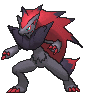

# Route 103 — Wild Pokémon

### Grass

| Sprite | Pokémon | Encounter Type | Level | Chance |
|:------:|---------|:--------------:|-------|--------|
|  | [Spearow](../../pokemon/spearow.md/) |  Grass | 5 | 10% |
|  | [Nidoran F](../../pokemon/nidoran-f.md/) |  Grass | 5 | 10% |
|  | [Nidoran M](../../pokemon/nidoran-m.md/) |  Grass | 5 | 10% |
|  | [Mankey](../../pokemon/mankey.md/) |  Grass | 5 | 10% |
|  | [Shellos](../../pokemon/shellos.md/) |  Grass | 5 | 10% |
|  | [Riolu*](../../pokemon/riolu.md/) |  Grass | 5 | 5% |
|  | [Patrat](../../pokemon/patrat.md/) |  Grass | 5 | 10% |
|  | [Lillipup](../../pokemon/lillipup.md/) |  Grass | 5 | 10% |
|  | [Purrloin](../../pokemon/purrloin.md/) |  Grass | 5 | 10% |
|  | [Pidove](../../pokemon/pidove.md/) |  Grass | 5 | 10% |
|  | [Zorua*](../../pokemon/zorua.md/) |  Grass | 5 | 5% |

### DexNav

| Sprite | Pokémon | Encounter Type | Level | Chance |
|:------:|---------|:--------------:|-------|--------|
|  | [Zoroark](../../pokemon/zoroark.md/) |  DexNav | 50 | 100% |

### Horde

| Sprite | Pokémon | Encounter Type | Level | Chance |
|:------:|---------|:--------------:|-------|--------|
|  | [Squirtle](../../pokemon/squirtle.md/) |  Horde | 5 | 50% |
|  | [Piplup](../../pokemon/piplup.md/) |  Horde | 5 | 50% |

### Surfing

| Sprite | Pokémon | Encounter Type | Level | Chance |
|:------:|---------|:--------------:|-------|--------|
|  | [Buizel](../../pokemon/buizel.md/) |  Surfing | 25 - 35 | 50% |
|  | [Floatzel](../../pokemon/floatzel.md/) |  Surfing | 25 - 35 | 50% |

### Old Rod

| Sprite | Pokémon | Encounter Type | Level | Chance |
|:------:|---------|:--------------:|-------|--------|
|  | [Poliwag](../../pokemon/poliwag.md/) |  Old Rod | 15 | 100% |

### Good Rod

| Sprite | Pokémon | Encounter Type | Level | Chance |
|:------:|---------|:--------------:|-------|--------|
|  | [Poliwag](../../pokemon/poliwag.md/) |  Good Rod | 35 | 100% |

### Super Rod

| Sprite | Pokémon | Encounter Type | Level | Chance |
|:------:|---------|:--------------:|-------|--------|
|  | [Poliwhirl](../../pokemon/poliwhirl.md/) |  Super Rod | 55 | 100% |

