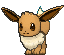
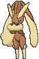
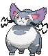

# Route 104 — Trainer Pokémon

## [ South ]

### Trainer Rosters

### Rematches

| Trainer | P1 | P2 | P3 | P4 |
|:-------:|:--:|:--:|:--:|:--:|
| ") Rich Boy Winston (1) [658] | 
 [Growlithe](../../pokemon/growlithe.md) Lv. 13
 | 
 [Lillipup](../../pokemon/lillipup.md) Lv. 13
 | 
 [Eevee](../../pokemon/eevee.md) Lv. 13
 |
| ") Rich Boy Winston (3) [659] | 
 [Growlithe](../../pokemon/growlithe.md) Lv. 25
 | 
 [Herdier](../../pokemon/herdier.md) Lv. 25
 | 
 [Flareon](../../pokemon/flareon.md) Lv. 25
 |
| ") Rich Boy Winston (5) [660] | 
 [Arcanine](../../pokemon/arcanine.md) Lv. 39
 | 
 [Stoutland](../../pokemon/stoutland.md) Lv. 39
 | 
 [Flareon](../../pokemon/flareon.md) Lv. 39
 | 
 [Rapidash](../../pokemon/rapidash.md) Lv. 39
 |
| ") Rich Boy Winston (C) [560] | 
 [Arcanine](../../pokemon/arcanine.md) Lv. 75
 | 
 [Stoutland](../../pokemon/stoutland.md) Lv. 75
 | 
 [Flareon](../../pokemon/flareon.md) Lv. 75
 | 
 [Rapidash](../../pokemon/rapidash.md) Lv. 75
 |

## [ North ]

### Trainer Rosters

### Rematches

| Trainer | P1 | P2 | P3 | P4 |
|:-------:|:--:|:--:|:--:|:--:|
| ") Lady Cindy (1) [655] | 
 [Vulpix](../../pokemon/vulpix.md) Lv. 13
 | 
 [Buneary](../../pokemon/buneary.md) Lv. 13
 | 
 [Eevee](../../pokemon/eevee.md) Lv. 13
 |
| ") Lady Cindy (3) [656] | 
 [Vulpix](../../pokemon/vulpix.md) Lv. 25
 | 
 [Buneary](../../pokemon/buneary.md) Lv. 25
 | 
 [Glaceon](../../pokemon/glaceon.md) Lv. 25
 |
| ") Lady Cindy (5) [657] | 
 [Ninetales](../../pokemon/ninetales.md) Lv. 39
 | 
 [Lopunny](../../pokemon/lopunny.md) Lv. 39
 | 
 [Glaceon](../../pokemon/glaceon.md) Lv. 39
 | 
 [Purugly](../../pokemon/purugly.md) Lv. 39
 |
| ") Lady Cindy (C) [559] | 
 [Ninetales](../../pokemon/ninetales.md) Lv. 75
 | 
 [Lopunny](../../pokemon/lopunny.md) Lv. 75
 | 
 [Glaceon](../../pokemon/glaceon.md) Lv. 75
 | 
 [Purugly](../../pokemon/purugly.md) Lv. 75
 |
| ") Lass Haley (1) [199] | 
 [Hoppip](../../pokemon/hoppip.md) Lv. 13
 | 
 [Eevee](../../pokemon/eevee.md) Lv. 13
 | 
 [Shroomish](../../pokemon/shroomish.md) Lv. 13
 |
| ") Lass Haley (3) [200] | 
 [Skiploom](../../pokemon/skiploom.md) Lv. 25
 | 
 [Leafeon](../../pokemon/leafeon.md) Lv. 25
 | 
 [Breloom](../../pokemon/breloom.md) Lv. 25
 |
| ") Lass Haley (4) [201] | 
 [Jumpluff](../../pokemon/jumpluff.md) Lv. 35
 | 
 [Leafeon](../../pokemon/leafeon.md) Lv. 35
 | 
 [Breloom](../../pokemon/breloom.md) Lv. 35
 | 
 [Whimsicott](../../pokemon/whimsicott.md) Lv. 35
 |
| ") Lass Haley (C) [202] | 
 [Jumpluff](../../pokemon/jumpluff.md) Lv. 75
 | 
 [Leafeon](../../pokemon/leafeon.md) Lv. 75
 | 
 [Breloom](../../pokemon/breloom.md) Lv. 75
 | 
 [Whimsicott](../../pokemon/whimsicott.md) Lv. 75
 |

