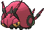
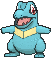
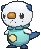
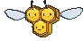
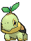

# Route 104 — Wild Pokémon

## [ South ]

### Grass

| Sprite | Pokémon | Encounter Type | Level | Chance |
|:------:|---------|:--------------:|-------|--------|
|  | [Psyduck](../../pokemon/psyduck.md/) |  Grass | 8 | 10% |
|  | [Slowpoke](../../pokemon/slowpoke.md/) |  Grass | 8 | 10% |
|  | [Exeggcute](../../pokemon/exeggcute.md/) |  Grass | 8 | 10% |
|  | [Wingull](../../pokemon/wingull.md/) |  Grass | 8 | 10% |
|  | [Taillow](../../pokemon/taillow.md/) |  Grass | 8 | 10% |
|  | [Azurill](../../pokemon/azurill.md/) |  Grass | 8 | 10% |
|  | [Sewaddle](../../pokemon/sewaddle.md/) |  Grass | 8 | 10% |
|  | [Venipede](../../pokemon/venipede.md/) |  Grass | 8 | 10% |
|  | [Scraggy](../../pokemon/scraggy.md/) |  Grass | 8 | 10% |
|  | [Spritzee*](../../pokemon/spritzee.md/) |  Grass | 8 | 5% |
|  | [Swirlix*](../../pokemon/swirlix.md/) |  Grass | 8 | 5% |

### DexNav

| Sprite | Pokémon | Encounter Type | Level | Chance |
|:------:|---------|:--------------:|-------|--------|
|  | [Exeggutor](../../pokemon/exeggutor.md/) |  DexNav | 50 | 100% |

### Horde

| Sprite | Pokémon | Encounter Type | Level | Chance |
|:------:|---------|:--------------:|-------|--------|
|  | [Totodile](../../pokemon/totodile.md/) |  Horde | 8 | 50% |
|  | [Oshawott](../../pokemon/oshawott.md/) |  Horde | 8 | 50% |

### Surfing

| Sprite | Pokémon | Encounter Type | Level | Chance |
|:------:|---------|:--------------:|-------|--------|
|  | [Wingull](../../pokemon/wingull.md/) |  Surfing | 25 - 35 | 100% |

### Old Rod

| Sprite | Pokémon | Encounter Type | Level | Chance |
|:------:|---------|:--------------:|-------|--------|
|  | [Luvdisc](../../pokemon/luvdisc.md/) |  Old Rod | 15 | 100% |

### Good Rod

| Sprite | Pokémon | Encounter Type | Level | Chance |
|:------:|---------|:--------------:|-------|--------|
|  | [Luvdisc](../../pokemon/luvdisc.md/) |  Good Rod | 35 | 100% |

### Super Rod

| Sprite | Pokémon | Encounter Type | Level | Chance |
|:------:|---------|:--------------:|-------|--------|
|  | [Luvdisc](../../pokemon/luvdisc.md/) |  Super Rod | 55 | 100% |

## [ North ]

### Grass

| Sprite | Pokémon | Encounter Type | Level | Chance |
|:------:|---------|:--------------:|-------|--------|
|  | [Ledyba](../../pokemon/ledyba.md/) |  Grass | 10 | 10% |
|  | [Togepi*](../../pokemon/togepi.md/) |  Grass | 10 | 5% |
|  | [Hoppip](../../pokemon/hoppip.md/) |  Grass | 10 | 10% |
|  | [Snubbull*](../../pokemon/snubbull.md/) |  Grass | 10 | 5% |
|  | [Kricketot](../../pokemon/kricketot.md/) |  Grass | 10 | 10% |
|  | [Budew](../../pokemon/budew.md/) |  Grass | 10 | 10% |
|  | [Burmy](../../pokemon/burmy.md/) |  Grass | 10 | 10% |
|  | [Combee](../../pokemon/combee.md/) |  Grass | 10 | 10% |
|  | [Buneary](../../pokemon/buneary.md/) |  Grass | 10 | 10% |
|  | [Scatterbug](../../pokemon/scatterbug.md/) |  Grass | 10 | 10% |
|  | [Flabébé](../../pokemon/flabebe.md/) |  Grass | 10 | 10% |

### DexNav

| Sprite | Pokémon | Encounter Type | Level | Chance |
|:------:|---------|:--------------:|-------|--------|
|  | [Vespiquen](../../pokemon/vespiquen.md/) |  DexNav | 50 | 100% |

### Horde

| Sprite | Pokémon | Encounter Type | Level | Chance |
|:------:|---------|:--------------:|-------|--------|
|  | [Turtwig](../../pokemon/turtwig.md/) |  Horde | 10 | 50% |
|  | [Froakie](../../pokemon/froakie.md/) |  Horde | 10 | 50% |

### Surfing

| Sprite | Pokémon | Encounter Type | Level | Chance |
|:------:|---------|:--------------:|-------|--------|
|  | [Basculin](../../pokemon/basculin-red-striped.md/) |  Surfing | 25 - 35 | 100% |

### Old Rod

| Sprite | Pokémon | Encounter Type | Level | Chance |
|:------:|---------|:--------------:|-------|--------|
|  | [Basculin](../../pokemon/basculin-red-striped.md/) |  Old Rod | 15 | 100% |

### Good Rod

| Sprite | Pokémon | Encounter Type | Level | Chance |
|:------:|---------|:--------------:|-------|--------|
|  | [Basculin](../../pokemon/basculin-red-striped.md/) |  Good Rod | 35 | 100% |

### Super Rod

| Sprite | Pokémon | Encounter Type | Level | Chance |
|:------:|---------|:--------------:|-------|--------|
|  | [Basculin](../../pokemon/basculin-red-striped.md/) |  Super Rod | 55 | 100% |

