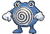

# Route 105 — Trainer Pokémon

## [ Main Area ]

### Trainer Rosters

| Trainer | P1 | P2 | P3 |
|:-------:|:--:|:--:|:--:|
|  Swimmer Beverly [028] | 
 [Wartortle](../../pokemon/wartortle.md) Lv. 36
 | 
 [Poliwhirl](../../pokemon/poliwhirl.md) Lv. 36
 | 
 [Golduck](../../pokemon/golduck.md) Lv. 36
 |
|  Triathlete Swimmer Vin [716] | 
 [Spheal](../../pokemon/spheal.md) Lv. 36
 | 
 [Seel](../../pokemon/seel.md) Lv. 36
 | 
 [Sealeo](../../pokemon/sealeo.md) Lv. 36
 |
|  Swimmer Dawn [029] | 
 [Luvdisc](../../pokemon/luvdisc.md) Lv. 36
 | 
 [Luvdisc](../../pokemon/luvdisc.md) Lv. 36
 | 
 [Alomomola](../../pokemon/alomomola.md) Lv. 36
 |
|  Ruin Maniac Foster [595] | 
 [Rampardos](../../pokemon/rampardos.md) Lv. 37
 | 
 [Relicanth](../../pokemon/relicanth.md) Lv. 37
 |
|  Swimmer Luis [026] | 
 [Buizel](../../pokemon/buizel.md) Lv. 37
 | 
 [Floatzel](../../pokemon/floatzel.md) Lv. 37
 |
|  Swimmer Austin [027] | 
 [Poliwhirl](../../pokemon/poliwhirl.md) Lv. 36
 | 
 [Dratini](../../pokemon/dratini.md) Lv. 36
 | 
 [Pelipper](../../pokemon/pelipper.md) Lv. 36
 |

