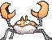
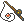

# Route 106 — Wild Pokémon

---

## [ Main Area ]

### DexNav

| Sprite | Pokémon | Encounter | Chance |
|:------:|---------|:---------:|--------|
|  | [Alomomola](../../pokemon/alomomola.md/) Lv. 50 |  DexNav | 100% |

### Surfing

| Sprite | Pokémon | Encounter | Chance |
|:------:|---------|:---------:|--------|
|  | [Wingull](../../pokemon/wingull.md/) Lv. 25 - 35 |  Surfing | 25% |
|  | [Tentacool](../../pokemon/tentacool.md/) Lv. 25 - 35 |  Surfing | 25% |
|  | [Frillish](../../pokemon/frillish.md/) Lv. 25 - 35 |  Surfing | 25% |
|  | [Pelipper](../../pokemon/pelipper.md/) Lv. 25 - 35 |  Surfing | 25% |

### Old Rod

| Sprite | Pokémon | Encounter | Chance |
|:------:|---------|:---------:|--------|
|  | [Krabby](../../pokemon/krabby.md/) Lv. 15 |  Old Rod | 33% |
|  | [Staryu](../../pokemon/staryu.md/) Lv. 15 |  Old Rod | 33% |
|  | [Corsola](../../pokemon/corsola.md/) Lv. 15 |  Old Rod | 33% |

### Good Rod

| Sprite | Pokémon | Encounter | Chance |
|:------:|---------|:---------:|--------|
|  | [Krabby](../../pokemon/krabby.md/) Lv. 35 |  Good Rod | 33% |
|  | [Staryu](../../pokemon/staryu.md/) Lv. 35 |  Good Rod | 33% |
|  | [Corsola](../../pokemon/corsola.md/) Lv. 35 |  Good Rod | 33% |

### Super Rod

| Sprite | Pokémon | Encounter | Chance |
|:------:|---------|:---------:|--------|
|  | [Kingler](../../pokemon/kingler.md/) Lv. 55 |  Super Rod | 33% |
|  | [Starmie](../../pokemon/starmie.md/) Lv. 55 |  Super Rod | 33% |
|  | [Corsola](../../pokemon/corsola.md/) Lv. 55 |  Super Rod | 33% |

