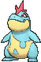
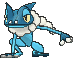
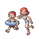
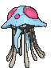

# Route 107 — Trainer Pokémon

---

## [ Main Area ]

### Trainer Rosters

| Trainer | P1 | P2 | P3 |
|:-------:|:--:|:--:|:--:|
|  Swimmer Beth [039] | 
 [Swanna](../../pokemon/swanna.md) Lv. 36
 | 
 [Croconaw](../../pokemon/croconaw.md) Lv. 36
 | 
 [Mantine](../../pokemon/mantine.md) Lv. 36
 |
|  Swimmer Denise [038] | 
 [Frogadier](../../pokemon/frogadier.md) Lv. 37
 | 
 [Gorebyss](../../pokemon/gorebyss.md) Lv. 37
 |
|  Swimmer Darrin [036] | 
 [Marshtomp](../../pokemon/marshtomp.md) Lv. 37
 | 
 [Huntail](../../pokemon/huntail.md) Lv. 37
 |
|  Sis & Bro Lisa and Ray [550] | 
 [Kingler](../../pokemon/kingler.md) Lv. 38
 | 
 its shell regularly. Immediately after molting, its shell is soft and tender. Until the shell hardens, this Pokémon hides in its streambed burrow to avoid attack from its foes.") [Crawdaunt](../../pokemon/crawdaunt.md) Lv. 39
 |
|  Swimmer Tony [037] | 
 [Frillish](../../pokemon/frillish.md) Lv. 37
 | 
 [Frillish](../../pokemon/frillish.md) Lv. 37
 |

### Rematches

| Trainer | P1 | P2 | P3 | P4 |
|:-------:|:--:|:--:|:--:|:--:|
| ") Swimmer Tony (6) [511] | 
 [Jellicent](../../pokemon/jellicent.md) Lv. 47
 | 
 [Jellicent](../../pokemon/jellicent.md) Lv. 47
 | 
 [Tentacruel](../../pokemon/tentacruel.md) Lv. 47
 |
| ") Swimmer Tony (7) [512] | 
 [Jellicent](../../pokemon/jellicent.md) Lv. 59
 | 
 [Jellicent](../../pokemon/jellicent.md) Lv. 59
 | 
 [Tentacruel](../../pokemon/tentacruel.md) Lv. 59
 | 
 [Tentacruel](../../pokemon/tentacruel.md) Lv. 59
 |
| ") Swimmer Tony (8) [513] | 
 [Jellicent](../../pokemon/jellicent.md) Lv. 64
 | 
 [Jellicent](../../pokemon/jellicent.md) Lv. 64
 | 
 [Tentacruel](../../pokemon/tentacruel.md) Lv. 64
 | 
 [Tentacruel](../../pokemon/tentacruel.md) Lv. 64
 |

---

## [ Underwater ]

### Trainer Rosters

| Trainer | P1 |
|:-------:|:--:|
|  Scuba Diver Keaton [739] | 
 [Wailord](../../pokemon/wailord.md) Lv. 60
 |
|  Free Diver Hollie [752] | 
 [Lanturn](../../pokemon/lanturn.md) Lv. 60
 |

