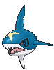
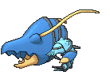

# Route 108 — Trainer Pokémon

---

## [ Main Area ]

### Trainer Rosters

| Trainer | P1 | P2 | P3 |
|:-------:|:--:|:--:|:--:|
|  Swimmer Jerome [040] | 
 [Palpitoad](../../pokemon/palpitoad.md) Lv. 36
 | 
 [Binacle](../../pokemon/binacle.md) Lv. 36
 | 
 [Sharpedo](../../pokemon/sharpedo.md) Lv. 36
 |
|  Swimmer Missy [043] | 
 [Milotic](../../pokemon/milotic.md) Lv. 38
 |
|  Swimmer Tara [042] | 
 [Vaporeon](../../pokemon/vaporeon.md) Lv. 38
 |
|  Ace Trainer Constance [841] | 
 [Eelektrik](../../pokemon/eelektrik.md) Lv. 38
 | 
 [Drifblim](../../pokemon/drifblim.md) Lv. 38
 | 
 [Vanillish](../../pokemon/vanillish.md) Lv. 38
 |
|  Ace Trainer Neville [806] | 
 [Nuzleaf](../../pokemon/nuzleaf.md) Lv. 38
 | 
 [Galvantula](../../pokemon/galvantula.md) Lv. 38
 | 
 [Clawitzer](../../pokemon/clawitzer.md) Lv. 38
 |
|  Swimmer Matthew [041] | 
 [Slowbro](../../pokemon/slowbro.md) Lv. 37
 | 
 [Slowking](../../pokemon/slowking.md) Lv. 37
 |

### Rematches

| Trainer | P1 | P2 | P3 | P4 | P5 |
|:-------:|:--:|:--:|:--:|:--:|:--:|
| ") Ace Trainer Neville (6) [810] | 
 [Shiftry](../../pokemon/shiftry.md) Lv. 47
 | 
 [Galvantula](../../pokemon/galvantula.md) Lv. 47
 | 
 [Clawitzer](../../pokemon/clawitzer.md) Lv. 47
 | 
 [Braviary](../../pokemon/braviary.md) Lv. 47
 |
| ") Ace Trainer Neville (7) [811] | 
 [Shiftry](../../pokemon/shiftry.md) Lv. 59
 | 
 [Galvantula](../../pokemon/galvantula.md) Lv. 59
 | 
 [Clawitzer](../../pokemon/clawitzer.md) Lv. 59
 | 
 [Braviary](../../pokemon/braviary.md) Lv. 59
 |
| ") Ace Trainer Neville (8) [812] | 
 [Shiftry](../../pokemon/shiftry.md) Lv. 64
 | 
 [Galvantula](../../pokemon/galvantula.md) Lv. 64
 | 
 [Clawitzer](../../pokemon/clawitzer.md) Lv. 64
 | 
 [Braviary](../../pokemon/braviary.md) Lv. 64
 |
| ") Ace Trainer Neville (C) [813] | 
 [Shiftry](../../pokemon/shiftry.md) Lv. 75
 | 
 [Galvantula](../../pokemon/galvantula.md) Lv. 75
 | 
 [Clawitzer](../../pokemon/clawitzer.md) Lv. 75
 | 
 [Braviary](../../pokemon/braviary.md) Lv. 75
 | 
 [Houndoom](../../pokemon/houndoom.md) Lv. 75
 |

