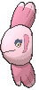

# Route 108 — Wild Pokémon

---

## [ Main Area ]

### DexNav

| Sprite | Pokémon | Encounter | Chance |
|:------:|---------|:---------:|--------|
|  | [Alomomola](../../pokemon/alomomola.md/) Lv. 50 |  DexNav | 100% |

### Surfing

| Sprite | Pokémon | Encounter | Chance |
|:------:|---------|:---------:|--------|
|  | [Mantyke](../../pokemon/mantyke.md/) Lv. 25 - 40 |  Surfing | 25% |
|  | [Mantine](../../pokemon/mantine.md/) Lv. 25 - 40 |  Surfing | 25% |
|  | [Tentacruel](../../pokemon/tentacruel.md/) Lv. 25 - 40 |  Surfing | 25% |
|  | [Jellicent](../../pokemon/jellicent.md/) Lv. 25 - 40 |  Surfing | 25% |

### Old Rod

| Sprite | Pokémon | Encounter | Chance |
|:------:|---------|:---------:|--------|
|  | [Finneon](../../pokemon/finneon.md/) Lv. 15 |  Old Rod | 33% |
|  | [Chinchou](../../pokemon/chinchou.md/) Lv. 15 |  Old Rod | 33% |
|  | [Corsola](../../pokemon/corsola.md/) Lv. 15 |  Old Rod | 33% |

### Good Rod

| Sprite | Pokémon | Encounter | Chance |
|:------:|---------|:---------:|--------|
|  | [Finneon](../../pokemon/finneon.md/) Lv. 35 |  Good Rod | 33% |
|  | [Chinchou](../../pokemon/chinchou.md/) Lv. 35 |  Good Rod | 33% |
|  | [Corsola](../../pokemon/corsola.md/) Lv. 35 |  Good Rod | 33% |

### Super Rod

| Sprite | Pokémon | Encounter | Chance |
|:------:|---------|:---------:|--------|
|  | [Lumineon](../../pokemon/lumineon.md/) Lv. 55 |  Super Rod | 33% |
|  | [Lanturn](../../pokemon/lanturn.md/) Lv. 55 |  Super Rod | 33% |
|  | [Corsola](../../pokemon/corsola.md/) Lv. 55 |  Super Rod | 33% |

