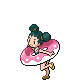
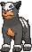
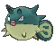

# Route 109 — Trainer Pokémon

---

## [ Main Area ]

### Trainer Rosters

| Trainer | P1 | P2 | P3 | P4 |
|:-------:|:--:|:--:|:--:|:--:|
|  Sailor Huey [046] | 
 [Wingull](../../pokemon/wingull.md) Lv. 17
 | 
 [Ducklett](../../pokemon/ducklett.md) Lv. 17
 | 
 [Shellos](../../pokemon/shellos.md) Lv. 17
 |
|  Sailor Edmond [047] | 
 [Shellder](../../pokemon/shellder.md) Lv. 17
 | 
 [Chinchou](../../pokemon/chinchou.md) Lv. 17
 | 
 [Horsea](../../pokemon/horsea.md) Lv. 17
 |
|  Tuber Ricky [564] | 
 [Zigzagoon](../../pokemon/zigzagoon.md) Lv. 17
 | 
 [Mantyke](../../pokemon/mantyke.md) Lv. 17
 |
|  Tuber Lola [565] | 
 [Psyduck](../../pokemon/psyduck.md) Lv. 17
 | 
 [Azurill](../../pokemon/azurill.md) Lv. 17
 |
|  Tuber Simon [209] | 
 [Mudkip](../../pokemon/mudkip.md) Lv. 15
 | 
 [Oshawott](../../pokemon/oshawott.md) Lv. 15
 | 
 [Squirtle](../../pokemon/squirtle.md) Lv. 15
 | 
 [Totodile](../../pokemon/totodile.md) Lv. 15
 |
|  Delinquent Destinee [798] | 
 [Purrloin](../../pokemon/purrloin.md) Lv. 19
 | 
 [Sableye](../../pokemon/sableye.md) Lv. 19
 |
|  Street Thug Blair [799] | 
 [Houndour](../../pokemon/houndour.md) Lv. 19
 | 
 [Murkrow](../../pokemon/murkrow.md) Lv. 19
 |
|  Beauty Johanna [515] | 
 [Mawile](../../pokemon/mawile.md) Lv. 19
 |
|  Sailor Dwayne [208] | 
 [Wooper](../../pokemon/wooper.md) Lv. 17
 | 
 [Corphish](../../pokemon/corphish.md) Lv. 17
 | 
 [Slowpoke](../../pokemon/slowpoke.md) Lv. 17
 |
|  Tuber Gwen [359] | 
 [Azumarill](../../pokemon/azumarill.md) Lv. 37
 |
|  Tuber Carmen [361] | 
 [Floatzel](../../pokemon/floatzel.md) Lv. 37
 |
|  Swimmer Alice [045] | 
 [Gastrodon](../../pokemon/gastrodon.md) Lv. 37
 | 
 [Gastrodon](../../pokemon/gastrodon.md) Lv. 37
 |
|  Swimmer David [044] | 
 [Octillery](../../pokemon/octillery.md) Lv. 37
 | 
 [Cloyster](../../pokemon/cloyster.md) Lv. 37
 |
|  Young Couple Mel & Paul [633] | 
 [Illumise](../../pokemon/illumise.md) Lv. 38
 | 
 [Volbeat](../../pokemon/volbeat.md) Lv. 38
 |
|  Fisherman Carter [360] | 
 [Qwilfish](../../pokemon/qwilfish.md) Lv. 38
 |
|  Ace Trainer Portia [815] | 
 [Snorunt](../../pokemon/snorunt.md) Lv. 38
 | 
 [Magcargo](../../pokemon/magcargo.md) Lv. 38
 | 
 [Gardevoir](../../pokemon/gardevoir.md) Lv. 38
 |

### Rematches

| Trainer | P1 | P2 | P3 | P4 | P5 |
|:-------:|:--:|:--:|:--:|:--:|:--:|
| ") Tuber Ricky (4) [598] | 
 [Linoone](../../pokemon/linoone.md) Lv. 35
 | 
 [Mantine](../../pokemon/mantine.md) Lv. 35
 | 
 [Floatzel](../../pokemon/floatzel.md) Lv. 35
 |
| ") Tuber Ricky (6) [599] | 
 [Linoone](../../pokemon/linoone.md) Lv. 47
 | 
 [Mantine](../../pokemon/mantine.md) Lv. 47
 | 
 [Floatzel](../../pokemon/floatzel.md) Lv. 47
 | 
 [Politoed](../../pokemon/politoed.md) Lv. 47
 |
| ") Tuber Ricky (7) [600] | 
 [Linoone](../../pokemon/linoone.md) Lv. 59
 | 
 [Mantine](../../pokemon/mantine.md) Lv. 59
 | 
 [Floatzel](../../pokemon/floatzel.md) Lv. 59
 | 
 [Politoed](../../pokemon/politoed.md) Lv. 59
 |
| ") Tuber Ricky (C) [601] | 
 [Linoone](../../pokemon/linoone.md) Lv. 75
 | 
 [Mantine](../../pokemon/mantine.md) Lv. 75
 | 
 [Floatzel](../../pokemon/floatzel.md) Lv. 75
 | 
 [Politoed](../../pokemon/politoed.md) Lv. 75
 |
| ") Tuber Lola (4) [373] | 
 [Golduck](../../pokemon/golduck.md) Lv. 35
 | 
 [Azumarill](../../pokemon/azumarill.md) Lv. 35
 | 
 [Bibarel](../../pokemon/bibarel.md) Lv. 35
 |
| ") Tuber Lola (6) [374] | 
 [Golduck](../../pokemon/golduck.md) Lv. 47
 | 
 [Azumarill](../../pokemon/azumarill.md) Lv. 47
 | 
 [Bibarel](../../pokemon/bibarel.md) Lv. 47
 | 
 [Starmie](../../pokemon/starmie.md) Lv. 47
 |
| ") Tuber Lola (7) [375] | 
 [Golduck](../../pokemon/golduck.md) Lv. 59
 | 
 [Azumarill](../../pokemon/azumarill.md) Lv. 59
 | 
 [Bibarel](../../pokemon/bibarel.md) Lv. 59
 | 
 [Starmie](../../pokemon/starmie.md) Lv. 59
 |
| ") Tuber Lola (C) [376] | 
 [Golduck](../../pokemon/golduck.md) Lv. 75
 | 
 [Azumarill](../../pokemon/azumarill.md) Lv. 75
 | 
 [Bibarel](../../pokemon/bibarel.md) Lv. 75
 | 
 [Starmie](../../pokemon/starmie.md) Lv. 75
 |
| ") Ace Trainer Portia (6) [819] | 
 [Froslass](../../pokemon/froslass.md) Lv. 47
 | 
 [Magcargo](../../pokemon/magcargo.md) Lv. 47
 | 
 [Gardevoir](../../pokemon/gardevoir.md) Lv. 47
 | 
 [Kecleon](../../pokemon/kecleon.md) Lv. 47
 |
| ") Ace Trainer Portia (7) [820] | 
 [Froslass](../../pokemon/froslass.md) Lv. 59
 | 
 [Magcargo](../../pokemon/magcargo.md) Lv. 59
 | 
 [Gardevoir](../../pokemon/gardevoir.md) Lv. 59
 | 
 [Kecleon](../../pokemon/kecleon.md) Lv. 59
 |
| ") Ace Trainer Portia (8) [821] | 
 [Froslass](../../pokemon/froslass.md) Lv. 64
 | 
 [Magcargo](../../pokemon/magcargo.md) Lv. 64
 | 
 [Gardevoir](../../pokemon/gardevoir.md) Lv. 64
 | 
 [Kecleon](../../pokemon/kecleon.md) Lv. 64
 |
| ") Ace Trainer Portia (C) [822] | 
 [Froslass](../../pokemon/froslass.md) Lv. 75
 | 
 [Magcargo](../../pokemon/magcargo.md) Lv. 75
 | 
 [Gardevoir](../../pokemon/gardevoir.md) Lv. 75
 | 
 [Kecleon](../../pokemon/kecleon.md) Lv. 75
 | 
 [Banette](../../pokemon/banette.md) Lv. 75
 |

