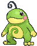

# Route 109 — Trainer Pokémon

## [ Main Area ]

### Trainer Rosters

### Rematches

| Trainer | P1 | P2 | P3 | P4 | P5 |
|:-------:|:--:|:--:|:--:|:--:|:--:|
| ") Tuber Ricky (4) [598] | 
 [Linoone](../../pokemon/linoone.md) Lv. 35
 | 
 [Mantine](../../pokemon/mantine.md) Lv. 35
 | 
 [Floatzel](../../pokemon/floatzel.md) Lv. 35
 |
| ") Tuber Ricky (6) [599] | 
 [Linoone](../../pokemon/linoone.md) Lv. 47
 | 
 [Mantine](../../pokemon/mantine.md) Lv. 47
 | 
 [Floatzel](../../pokemon/floatzel.md) Lv. 47
 | 
 [Politoed](../../pokemon/politoed.md) Lv. 47
 |
| ") Tuber Ricky (7) [600] | 
 [Linoone](../../pokemon/linoone.md) Lv. 59
 | 
 [Mantine](../../pokemon/mantine.md) Lv. 59
 | 
 [Floatzel](../../pokemon/floatzel.md) Lv. 59
 | 
 [Politoed](../../pokemon/politoed.md) Lv. 59
 |
| ") Tuber Ricky (C) [601] | 
 [Linoone](../../pokemon/linoone.md) Lv. 75
 | 
 [Mantine](../../pokemon/mantine.md) Lv. 75
 | 
 [Floatzel](../../pokemon/floatzel.md) Lv. 75
 | 
 [Politoed](../../pokemon/politoed.md) Lv. 75
 |
| ") Tuber Lola (4) [373] | 
 [Golduck](../../pokemon/golduck.md) Lv. 35
 | 
 [Azumarill](../../pokemon/azumarill.md) Lv. 35
 | 
 [Bibarel](../../pokemon/bibarel.md) Lv. 35
 |
| ") Tuber Lola (6) [374] | 
 [Golduck](../../pokemon/golduck.md) Lv. 47
 | 
 [Azumarill](../../pokemon/azumarill.md) Lv. 47
 | 
 [Bibarel](../../pokemon/bibarel.md) Lv. 47
 | 
 [Starmie](../../pokemon/starmie.md) Lv. 47
 |
| ") Tuber Lola (7) [375] | 
 [Golduck](../../pokemon/golduck.md) Lv. 59
 | 
 [Azumarill](../../pokemon/azumarill.md) Lv. 59
 | 
 [Bibarel](../../pokemon/bibarel.md) Lv. 59
 | 
 [Starmie](../../pokemon/starmie.md) Lv. 59
 |
| ") Tuber Lola (C) [376] | 
 [Golduck](../../pokemon/golduck.md) Lv. 75
 | 
 [Azumarill](../../pokemon/azumarill.md) Lv. 75
 | 
 [Bibarel](../../pokemon/bibarel.md) Lv. 75
 | 
 [Starmie](../../pokemon/starmie.md) Lv. 75
 |
| ") Ace Trainer Portia (6) [819] | 
 [Froslass](../../pokemon/froslass.md) Lv. 47
 | 
 [Magcargo](../../pokemon/magcargo.md) Lv. 47
 | 
 [Gardevoir](../../pokemon/gardevoir.md) Lv. 47
 | 
 [Kecleon](../../pokemon/kecleon.md) Lv. 47
 |
| ") Ace Trainer Portia (7) [820] | 
 [Froslass](../../pokemon/froslass.md) Lv. 59
 | 
 [Magcargo](../../pokemon/magcargo.md) Lv. 59
 | 
 [Gardevoir](../../pokemon/gardevoir.md) Lv. 59
 | 
 [Kecleon](../../pokemon/kecleon.md) Lv. 59
 |
| ") Ace Trainer Portia (8) [821] | 
 [Froslass](../../pokemon/froslass.md) Lv. 64
 | 
 [Magcargo](../../pokemon/magcargo.md) Lv. 64
 | 
 [Gardevoir](../../pokemon/gardevoir.md) Lv. 64
 | 
 [Kecleon](../../pokemon/kecleon.md) Lv. 64
 |
| ") Ace Trainer Portia (C) [822] | 
 [Froslass](../../pokemon/froslass.md) Lv. 75
 | 
 [Magcargo](../../pokemon/magcargo.md) Lv. 75
 | 
 [Gardevoir](../../pokemon/gardevoir.md) Lv. 75
 | 
 [Kecleon](../../pokemon/kecleon.md) Lv. 75
 | 
 [Banette](../../pokemon/banette.md) Lv. 75
 |

