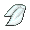
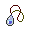
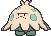

# Route 110 — Special Battles

---

## [ Trick House (Dark Room) ]

### Rival

 

=== "Mudkip"

	| Pokémon | Attributes | Item | Moves |
	|:-------:|------------|:----:|-------|
	|  | **Lv. 22** [Swellow](../../pokemon/swellow.md) **Ability:** Guts   |  Silk Scarf | 1. Brave Bird 2. Quick Attack 3. Focus Energy 4. Double Team |
	|  | **Lv. 22** [Ponyta](../../pokemon/ponyta.md) **Ability:** Flame Body  |  Charcoal | 1. Flame Charge 2. Double Kick 3. Stomp 4. Hypnosis |
	|  | **Lv. 22** [Wailmer](../../pokemon/wailmer.md) **Ability:** Water Veil  |  Mystic Water | 1. Water Pulse 2. Rollout 3. Fissure 4. Body Slam |
	|  | **Lv. 24** [Grovyle](../../pokemon/grovyle.md) **Ability:** Overgrow  |  Sitrus Berry | 1. Grass Pledge 2. Aerial Ace 3. Dragon Breath 4. Grass Whistle |
=== "Treecko"

	| Pokémon | Attributes | Item | Moves |
	|:-------:|------------|:----:|-------|
	|  | **Lv. 22** [Swellow](../../pokemon/swellow.md) **Ability:** Guts   |  Silk Scarf | 1. Brave Bird 2. Quick Attack 3. Focus Energy 4. Double Team |
	|  | **Lv. 22** [Wailmer](../../pokemon/wailmer.md) **Ability:** Water Veil  |  Mystic Water | 1. Water Pulse 2. Rollout 3. Fissure 4. Body Slam |
	|  | **Lv. 22** [Shroomish](../../pokemon/shroomish.md) **Ability:** Quick Feet  |  Miracle Seed | 1. Bullet Seed 2. Toxic 3. Headbutt 4. Leech Seed |
	|  | **Lv. 24** [Combusken](../../pokemon/combusken.md) **Ability:** Blaze   |  Sitrus Berry | 1. Fire Pledge 2. Double Kick 3. Aerial Ace 4. Feather Dance |
=== "Torchic"

	| Pokémon | Attributes | Item | Moves |
	|:-------:|------------|:----:|-------|
	|  | **Lv. 22** [Swellow](../../pokemon/swellow.md) **Ability:** Guts   |  Silk Scarf | 1. Brave Bird 2. Quick Attack 3. Focus Energy 4. Double Team |
	|  | **Lv. 22** [Shroomish](../../pokemon/shroomish.md) **Ability:** Quick Feet  |  Miracle Seed | 1. Bullet Seed 2. Toxic 3. Headbutt 4. Leech Seed |
	|  | **Lv. 22** [Ponyta](../../pokemon/ponyta.md) **Ability:** Flame Body  |  Charcoal | 1. Flame Charge 2. Double Kick 3. Stomp 4. Hypnosis |
	|  | **Lv. 24** [Marshtomp](../../pokemon/marshtomp.md) **Ability:** Torrent   |  Sitrus Berry | 1. Water Pledge 2. Dig 3. Rock Tomb 4. Curse |

