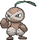
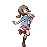
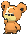

# Route 110 — Trainer Pokémon

---

## [ Main Area ]

### Trainer Rosters

### Rematches

| Trainer | P1 | P2 | P3 | P4 |
|:-------:|:--:|:--:|:--:|:--:|
| ") Poké Fan Isabel (4) [661] | 
 [Emolga](../../pokemon/emolga.md) Lv. 35
 | 
 [Pachirisu](../../pokemon/pachirisu.md) Lv. 35
 | 
 [Dedenne](../../pokemon/dedenne.md) Lv. 35
 |
| ") Poké Fan Isabel (5) [662] | 
 [Emolga](../../pokemon/emolga.md) Lv. 39
 | 
 [Pachirisu](../../pokemon/pachirisu.md) Lv. 39
 | 
 [Dedenne](../../pokemon/dedenne.md) Lv. 39
 | 
 [Pikachu](../../pokemon/pikachu.md) Lv. 39
 |
| ") Poké Fan Isabel (6) [663] | 
 [Emolga](../../pokemon/emolga.md) Lv. 47
 | 
 [Pachirisu](../../pokemon/pachirisu.md) Lv. 47
 | 
 [Dedenne](../../pokemon/dedenne.md) Lv. 47
 | 
 [Raichu](../../pokemon/raichu.md) Lv. 47
 |
| ") Poké Fan Isabel (C) [664] | 
 [Emolga](../../pokemon/emolga.md) Lv. 75
 | 
 [Pachirisu](../../pokemon/pachirisu.md) Lv. 75
 | 
 [Dedenne](../../pokemon/dedenne.md) Lv. 75
 | 
 [Raichu](../../pokemon/raichu.md) Lv. 75
 |
| ") Collector Edwin (4) [385] | 
 [Marowak](../../pokemon/marowak.md) Lv. 35
 | 
 [Lombre](../../pokemon/lombre.md) Lv. 35
 | 
 [Nuzleaf](../../pokemon/nuzleaf.md) Lv. 35
 | 
 [Kangaskhan](../../pokemon/kangaskhan.md) Lv. 35
 |
| ") Collector Edwin (7) [386] | 
 [Marowak](../../pokemon/marowak.md) Lv. 59
 | 
 [Ludicolo](../../pokemon/ludicolo.md) Lv. 59
 | 
 [Shiftry](../../pokemon/shiftry.md) Lv. 59
 | 
 [Kangaskhan](../../pokemon/kangaskhan.md) Lv. 59
 |
| ") Collector Edwin (8) [387] | 
 [Marowak](../../pokemon/marowak.md) Lv. 64
 | 
 [Ludicolo](../../pokemon/ludicolo.md) Lv. 64
 | 
 [Shiftry](../../pokemon/shiftry.md) Lv. 64
 | 
 [Kangaskhan](../../pokemon/kangaskhan.md) Lv. 64
 |
| ") Collector Edwin (C) [388] | 
 [Marowak](../../pokemon/marowak.md) Lv. 75
 | 
 [Ludicolo](../../pokemon/ludicolo.md) Lv. 75
 | 
 [Shiftry](../../pokemon/shiftry.md) Lv. 75
 | 
 [Kangaskhan](../../pokemon/kangaskhan.md) Lv. 75
 |

---

## [ Cycling Road ]

### Trainer Rosters

### Rematches

| Trainer | P1 | P2 | P3 | P4 |
|:-------:|:--:|:--:|:--:|:--:|
| ") Triathlete Biker Benjamin (4) [377] | 
 [Klang](../../pokemon/klang.md) Lv. 35
 | 
 [Electrode](../../pokemon/electrode.md) Lv. 35
 | 
 [Electabuzz](../../pokemon/electabuzz.md) Lv. 35
 |
| ") Triathlete Biker Benjamin (6) [378] | 
 [Klang](../../pokemon/klang.md) Lv. 47
 | 
 [Electrode](../../pokemon/electrode.md) Lv. 47
 | 
 [Electivire](../../pokemon/electivire.md) Lv. 47
 | 
 [Ampharos](../../pokemon/ampharos.md) Lv. 47
 |
| ") Triathlete Biker Benjamin (8) [379] | 
 [Klinklang](../../pokemon/klinklang.md) Lv. 64
 | 
 [Electrode](../../pokemon/electrode.md) Lv. 64
 | 
 [Electivire](../../pokemon/electivire.md) Lv. 64
 | 
 [Ampharos](../../pokemon/ampharos.md) Lv. 64
 |
| ") Triathlete Biker Benjamin (C) [380] | 
 [Klinklang](../../pokemon/klinklang.md) Lv. 75
 | 
 [Electrode](../../pokemon/electrode.md) Lv. 75
 | 
 [Electivire](../../pokemon/electivire.md) Lv. 75
 | 
 [Ampharos](../../pokemon/ampharos.md) Lv. 75
 |

---

## [ Trick House (Cut) ]

### Trainer Rosters

| Trainer | P1 | P2 | P3 |
|:-------:|:--:|:--:|:--:|
|  Lass Sally [211] | 
 [Froakie](../../pokemon/froakie.md) Lv. 20
 | 
 [Fennekin](../../pokemon/fennekin.md) Lv. 20
 | 
 [Chespin](../../pokemon/chespin.md) Lv. 20
 |
|  Battle Girl Cora [213] | 
 [Heracross](../../pokemon/heracross.md) Lv. 23
 |
|  Youngster Eddie [210] | 
 [Turtwig](../../pokemon/turtwig.md) Lv. 20
 | 
 [Chimchar](../../pokemon/chimchar.md) Lv. 20
 | 
 [Piplup](../../pokemon/piplup.md) Lv. 20
 |

---

## [ Trick House (Rock Smash) ]

### Trainer Rosters

| Trainer | P1 | P2 | P3 |
|:-------:|:--:|:--:|:--:|
|  Black Belt Yuji [221] | 
 [Hawlucha](../../pokemon/hawlucha.md) Lv. 27
 |
|  Schoolkid Georgie [217] | 
 [Pansear](../../pokemon/pansear.md) Lv. 24
 | 
 [Pidgeotto](../../pokemon/pidgeotto.md) Lv. 24
 | 
 [Charmander](../../pokemon/charmander.md) Lv. 24
 |
|  PKMN Ranger Sebastian [222] | 
 [Deerling](../../pokemon/deerling.md) Lv. 25
 | 
 [Weepinbell](../../pokemon/weepinbell.md) Lv. 25
 | 
 [Ponyta](../../pokemon/ponyta.md) Lv. 25
 |
|  PKMN Ranger Sophia [223] | 
 [Skiddo](../../pokemon/skiddo.md) Lv. 25
 | 
 [Gloom](../../pokemon/gloom.md) Lv. 25
 | 
 [Teddiursa](../../pokemon/teddiursa.md) Lv. 25
 |

---

## [ Trick House (Dark Room) ]

### Trainer Rosters

### Special Battles

| Trainer | P1 | P2 | P3 |
|:-------:|:--:|:--:|:--:|

