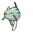

# Route 110 — Wild Pokémon

### Grass

| Sprite | Pokémon | Encounter Type | Level | Chance |
|:------:|---------|:--------------:|-------|--------|
|  | [Oddish](../../pokemon/oddish.md/) |  Grass | 17 | 10% |
|  | [Magnemite](../../pokemon/magnemite.md/) |  Grass | 17 | 10% |
|  | [Voltorb](../../pokemon/voltorb.md/) |  Grass | 17 | 10% |
|  | [Wooper](../../pokemon/wooper.md/) |  Grass | 17 | 10% |
|  | [Electrike](../../pokemon/electrike.md/) |  Grass | 17 | 10% |
|  | [Gulpin](../../pokemon/gulpin.md/) |  Grass | 17 | 10% |
|  | [Drifloon](../../pokemon/drifloon.md/) |  Grass | 17 | 10% |
|  | [Trubbish](../../pokemon/trubbish.md/) |  Grass | 17 | 10% |
|  | [Minccino](../../pokemon/minccino.md/) |  Grass | 17 | 10% |
|  | [Skiddo](../../pokemon/skiddo.md/) |  Grass | 17 | 10% |

### DexNav

| Sprite | Pokémon | Encounter Type | Level | Chance |
|:------:|---------|:--------------:|-------|--------|
|  | [Cinccino](../../pokemon/cinccino.md/) |  DexNav | 50 | 100% |

### Horde

| Sprite | Pokémon | Encounter Type | Level | Chance |
|:------:|---------|:--------------:|-------|--------|
|  | [Plusle](../../pokemon/plusle.md/) |  Horde | 12 | 50% |
|  | [Minun](../../pokemon/minun.md/) |  Horde | 12 | 50% |

### Surfing

| Sprite | Pokémon | Encounter Type | Level | Chance |
|:------:|---------|:--------------:|-------|--------|
|  | [Wooper](../../pokemon/wooper.md/) |  Surfing | 25 - 35 | 50% |
|  | [Quagsire](../../pokemon/quagsire.md/) |  Surfing | 25 - 35 | 50% |

### Old Rod

| Sprite | Pokémon | Encounter Type | Level | Chance |
|:------:|---------|:--------------:|-------|--------|
|  | [Remoraid](../../pokemon/remoraid.md/) |  Old Rod | 20 | 50% |
|  | [Qwilfish](../../pokemon/qwilfish.md/) |  Old Rod | 20 | 50% |

### Good Rod

| Sprite | Pokémon | Encounter Type | Level | Chance |
|:------:|---------|:--------------:|-------|--------|
|  | [Remoraid](../../pokemon/remoraid.md/) |  Good Rod | 35 | 50% |
|  | [Qwilfish](../../pokemon/qwilfish.md/) |  Good Rod | 35 | 50% |

### Super Rod

| Sprite | Pokémon | Encounter Type | Level | Chance |
|:------:|---------|:--------------:|-------|--------|
|  | [Octillery](../../pokemon/octillery.md/) |  Super Rod | 55 | 50% |
|  | [Qwilfish](../../pokemon/qwilfish.md/) |  Super Rod | 55 | 50% |

