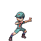
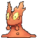
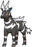
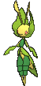
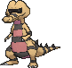
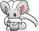

# Route 111 — Trainer Pokémon

---

## [ Main Area ]

### Trainer Rosters

| Trainer | P1 | P2 | P3 | P4 |
|:-------:|:--:|:--:|:--:|:--:|
|  The Winstrates' Victor [641] | 
 [Delcatty](../../pokemon/delcatty.md) Lv. 25
 | 
 [Wigglytuff](../../pokemon/wigglytuff.md) Lv. 25
 |
|  The Winstrates' Victoria [642] | 
 [Bellossom](../../pokemon/bellossom.md) Lv. 25
 | 
 [Roserade](../../pokemon/roserade.md) Lv. 25
 |
|  The Winstrates' Vivi [076] | 
 [Cloyster](../../pokemon/cloyster.md) Lv. 25
 | 
 [Starmie](../../pokemon/starmie.md) Lv. 25
 |
|  The Winstrates' Vicky [578] | 
 [Machamp](../../pokemon/machamp.md) Lv. 28
 |
|  Interviewers Gabby & Ty [173] | 
 [Magnemite](../../pokemon/magnemite.md) Lv. 25
 | 
 [Whismur](../../pokemon/whismur.md) Lv. 25
 | 
 [Porygon](../../pokemon/porygon.md) Lv. 25
 | 
 [Rotom](../../pokemon/rotom.md) Lv. 25
 |
|  Picnicker Irene [308] | 
 [Meowth](../../pokemon/meowth.md) Lv. 24
 | 
 [Espurr](../../pokemon/espurr.md) Lv. 24
 | 
 [Hoothoot](../../pokemon/hoothoot.md) Lv. 24
 |
|  Camper Travis [309] | 
 [Ekans](../../pokemon/ekans.md) Lv. 23
 | 
 [Diglett](../../pokemon/diglett.md) Lv. 23
 | 
 [Slugma](../../pokemon/slugma.md) Lv. 23
 | 
 [Pawniard](../../pokemon/pawniard.md) Lv. 23
 |
|  Backpacker Emory [721] | 
 [Heatmor](../../pokemon/heatmor.md) Lv. 25
 | 
 [Carnivine](../../pokemon/carnivine.md) Lv. 25
 |
|  Ace Trainer Wilton [310] | 
 [Zebstrika](../../pokemon/zebstrika.md) Lv. 29
 | 
 [Scyther](../../pokemon/scyther.md) Lv. 29
 | 
 [Quagsire](../../pokemon/quagsire.md) Lv. 29
 |
|  Fairy Tale Girl Cece [762] | 
 [Snubbull](../../pokemon/snubbull.md) Lv. 28
 | 
 [Mr. Mime](../../pokemon/mr-mime.md) Lv. 28
 |
|  Backpacker Deon [722] | 
 [Linoone](../../pokemon/linoone.md) Lv. 27
 | 
 [Bibarel](../../pokemon/bibarel.md) Lv. 27
 | 
 [Diggersby](../../pokemon/diggersby.md) Lv. 27
 |
|  Ace Trainer Brooke [311] | 
 [Ninetales](../../pokemon/ninetales.md) Lv. 29
 | 
 [Miltank](../../pokemon/miltank.md) Lv. 29
 | 
 [Leavanny](../../pokemon/leavanny.md) Lv. 29
 |

### Rematches

| Trainer | P1 | P2 | P3 | P4 | P5 |
|:-------:|:--:|:--:|:--:|:--:|:--:|
| ") Interviewers Gabby & Ty (5) [174] | 
 [Magneton](../../pokemon/magneton.md) Lv. 39
 | 
 [Loudred](../../pokemon/loudred.md) Lv. 39
 | 
 [Porygon2](../../pokemon/porygon2.md) Lv. 39
 | 
 [Rotom](../../pokemon/rotom.md) Lv. 39
 |
| ") Interviewers Gabby & Ty (6) [175] | 
 [Magnezone](../../pokemon/magnezone.md) Lv. 47
 | 
 [Exploud](../../pokemon/exploud.md) Lv. 47
 | 
 [Porygon2](../../pokemon/porygon2.md) Lv. 47
 | 
 [Rotom](../../pokemon/rotom.md) Lv. 47
 |
| ") Interviewers Gabby & Ty (7) [176] | 
 [Magnezone](../../pokemon/magnezone.md) Lv. 59
 | 
 [Exploud](../../pokemon/exploud.md) Lv. 59
 | 
 [Porygon-Z](../../pokemon/porygon-z.md) Lv. 59
 | 
 [Rotom](../../pokemon/rotom.md) Lv. 59
 |
| ") Interviewers Gabby & Ty (8) [177] | 
 [Magnezone](../../pokemon/magnezone.md) Lv. 64
 | 
 [Exploud](../../pokemon/exploud.md) Lv. 64
 | 
 [Porygon-Z](../../pokemon/porygon-z.md) Lv. 64
 | 
 [Rotom](../../pokemon/rotom.md) Lv. 64
 |
| ") Interviewers Gabby & Ty (C) [582] | 
 [Magnezone](../../pokemon/magnezone.md) Lv. 75
 | 
 [Exploud](../../pokemon/exploud.md) Lv. 75
 | 
 [Porygon-Z](../../pokemon/porygon-z.md) Lv. 75
 | 
 [Rotom](../../pokemon/rotom.md) Lv. 75
 |
| ") Ace Trainer Wilton (4) [389] | 
 [Zebstrika](../../pokemon/zebstrika.md) Lv. 35
 | 
 [Scyther](../../pokemon/scyther.md) Lv. 35
 | 
 [Quagsire](../../pokemon/quagsire.md) Lv. 35
 | 
 [Torkoal](../../pokemon/torkoal.md) Lv. 35
 |
| ") Ace Trainer Wilton (6) [390] | 
 [Zebstrika](../../pokemon/zebstrika.md) Lv. 47
 | 
 [Scizor](../../pokemon/scizor.md) Lv. 47
 | 
 [Quagsire](../../pokemon/quagsire.md) Lv. 47
 | 
 [Torkoal](../../pokemon/torkoal.md) Lv. 47
 |
| ") Ace Trainer Wilton (8) [391] | 
 [Zebstrika](../../pokemon/zebstrika.md) Lv. 64
 | 
 [Scizor](../../pokemon/scizor.md) Lv. 64
 | 
 [Quagsire](../../pokemon/quagsire.md) Lv. 64
 | 
 [Torkoal](../../pokemon/torkoal.md) Lv. 64
 |
| ") Ace Trainer Wilton (C) [392] | 
 [Zebstrika](../../pokemon/zebstrika.md) Lv. 75
 | 
 [Scizor](../../pokemon/scizor.md) Lv. 75
 | 
 [Quagsire](../../pokemon/quagsire.md) Lv. 75
 | 
 [Torkoal](../../pokemon/torkoal.md) Lv. 75
 | 
 [Venusaur](../../pokemon/venusaur.md) Lv. 75
 |
| ") Ace Trainer Brooke (4) [393] | 
 [Ninetales](../../pokemon/ninetales.md) Lv. 35
 | 
 [Miltank](../../pokemon/miltank.md) Lv. 35
 | 
 [Leavanny](../../pokemon/leavanny.md) Lv. 35
 | 
 [Lapras](../../pokemon/lapras.md) Lv. 35
 |
| ") Ace Trainer Brooke (6) [394] | 
 [Ninetales](../../pokemon/ninetales.md) Lv. 47
 | 
 [Miltank](../../pokemon/miltank.md) Lv. 47
 | 
 [Leavanny](../../pokemon/leavanny.md) Lv. 47
 | 
 [Lapras](../../pokemon/lapras.md) Lv. 47
 |
| ") Ace Trainer Brooke (8) [395] | 
 [Ninetales](../../pokemon/ninetales.md) Lv. 64
 | 
 [Miltank](../../pokemon/miltank.md) Lv. 64
 | 
 [Leavanny](../../pokemon/leavanny.md) Lv. 64
 | 
 [Lapras](../../pokemon/lapras.md) Lv. 64
 |
| ") Ace Trainer Brooke (C) [396] | 
 [Ninetales](../../pokemon/ninetales.md) Lv. 75
 | 
 [Miltank](../../pokemon/miltank.md) Lv. 75
 | 
 [Leavanny](../../pokemon/leavanny.md) Lv. 75
 | 
 [Lapras](../../pokemon/lapras.md) Lv. 75
 | 
 [Steelix](../../pokemon/steelix.md) Lv. 75
 |

---

## [ Desert ]

### Trainer Rosters

| Trainer | P1 | P2 | P3 |
|:-------:|:--:|:--:|:--:|
|  Camper Cliff [575] | 
 [Gabite](../../pokemon/gabite.md) Lv. 35
 | 
 [Sandslash](../../pokemon/sandslash.md) Lv. 35
 | 
 [Cacturne](../../pokemon/cacturne.md) Lv. 35
 |
|  Picnicker Heidi [574] | 
 [Hippopotas](../../pokemon/hippopotas.md) Lv. 35
 | 
 [Baltoy](../../pokemon/baltoy.md) Lv. 35
 | 
 [Hippowdon](../../pokemon/hippowdon.md) Lv. 35
 |
|  Camper Drew [573] | 
 [Krokorok](../../pokemon/krokorok.md) Lv. 35
 | 
 [Vibrava](../../pokemon/vibrava.md) Lv. 35
 | 
 [Heliolisk](../../pokemon/heliolisk.md) Lv. 35
 |
|  Picnicker Becky [576] | 
 [Crustle](../../pokemon/crustle.md) Lv. 36
 | 
 [Cinccino](../../pokemon/cinccino.md) Lv. 36
 |
|  Black Belt Daisuke [312] | 
 [Machoke](../../pokemon/machoke.md) Lv. 37
 | 
 [Medicham](../../pokemon/medicham.md) Lv. 37
 |
|  Ruin Maniac Dusty [577] | 
 [Sigilyph](../../pokemon/sigilyph.md) Lv. 36
 | 
 [Claydol](../../pokemon/claydol.md) Lv. 36
 |

### Rematches

| Trainer | P1 | P2 | P3 | P4 | P5 |
|:-------:|:--:|:--:|:--:|:--:|:--:|
| ") Ruin Maniac Dusty (5) [602] | 
 [Sigilyph](../../pokemon/sigilyph.md) Lv. 39
 | 
 [Claydol](../../pokemon/claydol.md) Lv. 39
 | 
 [Aerodactyl](../../pokemon/aerodactyl.md) Lv. 39
 |
| ") Ruin Maniac Dusty (6) [603] | 
 [Sigilyph](../../pokemon/sigilyph.md) Lv. 47
 | 
 [Claydol](../../pokemon/claydol.md) Lv. 47
 | 
 [Aerodactyl](../../pokemon/aerodactyl.md) Lv. 47
 | 
 [Omastar](../../pokemon/omastar.md) Lv. 47
 | 
 [Kabutops](../../pokemon/kabutops.md) Lv. 47
 |
| ") Ruin Maniac Dusty (7) [604] | 
 [Sigilyph](../../pokemon/sigilyph.md) Lv. 59
 | 
 [Claydol](../../pokemon/claydol.md) Lv. 59
 | 
 [Aerodactyl](../../pokemon/aerodactyl.md) Lv. 59
 | 
 [Omastar](../../pokemon/omastar.md) Lv. 59
 | 
 [Kabutops](../../pokemon/kabutops.md) Lv. 59
 |
| ") Ruin Maniac Dusty (C) [605] | 
 [Sigilyph](../../pokemon/sigilyph.md) Lv. 75
 | 
 [Claydol](../../pokemon/claydol.md) Lv. 75
 | 
 [Aerodactyl](../../pokemon/aerodactyl.md) Lv. 75
 | 
 [Omastar](../../pokemon/omastar.md) Lv. 75
 | 
 [Kabutops](../../pokemon/kabutops.md) Lv. 75
 |

