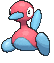

# Route 111 — Trainer Pokémon

---

## [ Main Area ]

### Trainer Rosters

### Rematches

| Trainer | P1 | P2 | P3 | P4 | P5 |
|:-------:|:--:|:--:|:--:|:--:|:--:|
| ") Interviewers Gabby & Ty (5) [174] | 
 [Magneton](../../pokemon/magneton.md) Lv. 39
 | 
 [Loudred](../../pokemon/loudred.md) Lv. 39
 | 
 [Porygon2](../../pokemon/porygon2.md) Lv. 39
 | 
 [Rotom](../../pokemon/rotom.md) Lv. 39
 |
| ") Interviewers Gabby & Ty (6) [175] | 
 [Magnezone](../../pokemon/magnezone.md) Lv. 47
 | 
 [Exploud](../../pokemon/exploud.md) Lv. 47
 | 
 [Porygon2](../../pokemon/porygon2.md) Lv. 47
 | 
 [Rotom](../../pokemon/rotom.md) Lv. 47
 |
| ") Interviewers Gabby & Ty (7) [176] | 
 [Magnezone](../../pokemon/magnezone.md) Lv. 59
 | 
 [Exploud](../../pokemon/exploud.md) Lv. 59
 | 
 [Porygon-Z](../../pokemon/porygon-z.md) Lv. 59
 | 
 [Rotom](../../pokemon/rotom.md) Lv. 59
 |
| ") Interviewers Gabby & Ty (8) [177] | 
 [Magnezone](../../pokemon/magnezone.md) Lv. 64
 | 
 [Exploud](../../pokemon/exploud.md) Lv. 64
 | 
 [Porygon-Z](../../pokemon/porygon-z.md) Lv. 64
 | 
 [Rotom](../../pokemon/rotom.md) Lv. 64
 |
| ") Interviewers Gabby & Ty (C) [582] | 
 [Magnezone](../../pokemon/magnezone.md) Lv. 75
 | 
 [Exploud](../../pokemon/exploud.md) Lv. 75
 | 
 [Porygon-Z](../../pokemon/porygon-z.md) Lv. 75
 | 
 [Rotom](../../pokemon/rotom.md) Lv. 75
 |
| ") Ace Trainer Wilton (4) [389] | 
 [Zebstrika](../../pokemon/zebstrika.md) Lv. 35
 | 
 [Scyther](../../pokemon/scyther.md) Lv. 35
 | 
 [Quagsire](../../pokemon/quagsire.md) Lv. 35
 | 
 [Torkoal](../../pokemon/torkoal.md) Lv. 35
 |
| ") Ace Trainer Wilton (6) [390] | 
 [Zebstrika](../../pokemon/zebstrika.md) Lv. 47
 | 
 [Scizor](../../pokemon/scizor.md) Lv. 47
 | 
 [Quagsire](../../pokemon/quagsire.md) Lv. 47
 | 
 [Torkoal](../../pokemon/torkoal.md) Lv. 47
 |
| ") Ace Trainer Wilton (8) [391] | 
 [Zebstrika](../../pokemon/zebstrika.md) Lv. 64
 | 
 [Scizor](../../pokemon/scizor.md) Lv. 64
 | 
 [Quagsire](../../pokemon/quagsire.md) Lv. 64
 | 
 [Torkoal](../../pokemon/torkoal.md) Lv. 64
 |
| ") Ace Trainer Wilton (C) [392] | 
 [Zebstrika](../../pokemon/zebstrika.md) Lv. 75
 | 
 [Scizor](../../pokemon/scizor.md) Lv. 75
 | 
 [Quagsire](../../pokemon/quagsire.md) Lv. 75
 | 
 [Torkoal](../../pokemon/torkoal.md) Lv. 75
 | 
 [Venusaur](../../pokemon/venusaur.md) Lv. 75
 |
| ") Ace Trainer Brooke (4) [393] | 
 [Ninetales](../../pokemon/ninetales.md) Lv. 35
 | 
 [Miltank](../../pokemon/miltank.md) Lv. 35
 | 
 [Leavanny](../../pokemon/leavanny.md) Lv. 35
 | 
 [Lapras](../../pokemon/lapras.md) Lv. 35
 |
| ") Ace Trainer Brooke (6) [394] | 
 [Ninetales](../../pokemon/ninetales.md) Lv. 47
 | 
 [Miltank](../../pokemon/miltank.md) Lv. 47
 | 
 [Leavanny](../../pokemon/leavanny.md) Lv. 47
 | 
 [Lapras](../../pokemon/lapras.md) Lv. 47
 |
| ") Ace Trainer Brooke (8) [395] | 
 [Ninetales](../../pokemon/ninetales.md) Lv. 64
 | 
 [Miltank](../../pokemon/miltank.md) Lv. 64
 | 
 [Leavanny](../../pokemon/leavanny.md) Lv. 64
 | 
 [Lapras](../../pokemon/lapras.md) Lv. 64
 |
| ") Ace Trainer Brooke (C) [396] | 
 [Ninetales](../../pokemon/ninetales.md) Lv. 75
 | 
 [Miltank](../../pokemon/miltank.md) Lv. 75
 | 
 [Leavanny](../../pokemon/leavanny.md) Lv. 75
 | 
 [Lapras](../../pokemon/lapras.md) Lv. 75
 | 
 [Steelix](../../pokemon/steelix.md) Lv. 75
 |

---

## [ Desert ]

### Trainer Rosters

### Rematches

| Trainer | P1 | P2 | P3 | P4 | P5 |
|:-------:|:--:|:--:|:--:|:--:|:--:|
| ") Ruin Maniac Dusty (5) [602] | 
 [Sigilyph](../../pokemon/sigilyph.md) Lv. 39
 | 
 [Claydol](../../pokemon/claydol.md) Lv. 39
 | 
 [Aerodactyl](../../pokemon/aerodactyl.md) Lv. 39
 |
| ") Ruin Maniac Dusty (6) [603] | 
 [Sigilyph](../../pokemon/sigilyph.md) Lv. 47
 | 
 [Claydol](../../pokemon/claydol.md) Lv. 47
 | 
 [Aerodactyl](../../pokemon/aerodactyl.md) Lv. 47
 | 
 [Omastar](../../pokemon/omastar.md) Lv. 47
 | 
 [Kabutops](../../pokemon/kabutops.md) Lv. 47
 |
| ") Ruin Maniac Dusty (7) [604] | 
 [Sigilyph](../../pokemon/sigilyph.md) Lv. 59
 | 
 [Claydol](../../pokemon/claydol.md) Lv. 59
 | 
 [Aerodactyl](../../pokemon/aerodactyl.md) Lv. 59
 | 
 [Omastar](../../pokemon/omastar.md) Lv. 59
 | 
 [Kabutops](../../pokemon/kabutops.md) Lv. 59
 |
| ") Ruin Maniac Dusty (C) [605] | 
 [Sigilyph](../../pokemon/sigilyph.md) Lv. 75
 | 
 [Claydol](../../pokemon/claydol.md) Lv. 75
 | 
 [Aerodactyl](../../pokemon/aerodactyl.md) Lv. 75
 | 
 [Omastar](../../pokemon/omastar.md) Lv. 75
 | 
 [Kabutops](../../pokemon/kabutops.md) Lv. 75
 |

