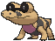
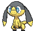

# Route 111 — Wild Pokémon

---

## [ Main Area ]

### Rock Smash

| Sprite | Pokémon | Encounter | Chance |
|:------:|---------|:---------:|--------|
|  | [Geodude](../../pokemon/geodude.md/) Lv. 22 |  Rock Smash | 50% |
|  | [Binacle](../../pokemon/binacle.md/) Lv. 22 |  Rock Smash | 50% |

### Surfing

| Sprite | Pokémon | Encounter | Chance |
|:------:|---------|:---------:|--------|
|  | [Basculin](../../pokemon/basculin-red-striped.md/) Lv. 25 - 35 |  Surfing | 100% |

### Old Rod

| Sprite | Pokémon | Encounter | Chance |
|:------:|---------|:---------:|--------|
|  | [Magikarp](../../pokemon/magikarp.md/) Lv. 20 |  Old Rod | 50% |
|  | [Barboach](../../pokemon/barboach.md/) Lv. 20 |  Old Rod | 50% |

### Good Rod

| Sprite | Pokémon | Encounter | Chance |
|:------:|---------|:---------:|--------|
|  | [Magikarp](../../pokemon/magikarp.md/) Lv. 35 |  Good Rod | 50% |
|  | [Barboach](../../pokemon/barboach.md/) Lv. 35 |  Good Rod | 50% |

### Super Rod

| Sprite | Pokémon | Encounter | Chance |
|:------:|---------|:---------:|--------|
|  | [Gyarados](../../pokemon/gyarados.md/) Lv. 55 |  Super Rod | 50% |
|  | [Whiscash](../../pokemon/whiscash.md/) Lv. 55 |  Super Rod | 50% |

---

## [ Desert ]

**Hint:** <i>Each Pokémon found regularly in the sand has a 50% chance of holding a particular fossil!</i>

### Grass

| Sprite | Pokémon | Encounter | Chance |
|:------:|---------|:---------:|--------|
|  | [Sandslash](../../pokemon/sandslash.md/) Lv. 31 |  Grass | 10% |
|  | [Trapinch](../../pokemon/trapinch.md/) Lv. 31 |  Grass | 10% |
|  | [Cacnea](../../pokemon/cacnea.md/) Lv. 31 |  Grass | 10% |
|  | [Baltoy](../../pokemon/baltoy.md/) Lv. 31 |  Grass | 10% |
|  | [Gible](../../pokemon/gible.md/) Lv. 31 |  Grass | 10% |
|  | [Hippopotas](../../pokemon/hippopotas.md/) Lv. 31 |  Grass | 10% |
|  | [Sandile](../../pokemon/sandile.md/) Lv. 31 |  Grass | 10% |
|  | [Darumaka](../../pokemon/darumaka.md/) Lv. 31 |  Grass | 10% |
|  | [Maractus*](../../pokemon/maractus.md/) Lv. 31 |  Grass | 5% |
|  | [Sigilyph*](../../pokemon/sigilyph.md/) Lv. 31 |  Grass | 5% |
|  | [Helioptile](../../pokemon/helioptile.md/) Lv. 31 |  Grass | 10% |

### DexNav

| Sprite | Pokémon | Encounter | Chance |
|:------:|---------|:---------:|--------|
|  | [Vibrava](../../pokemon/vibrava.md/) Lv. 50 |  DexNav | 100% |

### Horde

| Sprite | Pokémon | Encounter | Chance |
|:------:|---------|:---------:|--------|
|  | [Sandshrew](../../pokemon/sandshrew.md/) Lv. 18 |  Horde | 100% |

