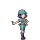
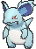

# Route 112 — Trainer Pokémon

---

## [ South ]

### Trainer Rosters

| Trainer | P1 | P2 | P3 |
|:-------:|:--:|:--:|:--:|
|  Camper Larry [079] | 
 [Karrablast](../../pokemon/karrablast.md) Lv. 25
 | 
 [Turtwig](../../pokemon/turtwig.md) Lv. 25
 | 
 [Skorupi](../../pokemon/skorupi.md) Lv. 25
 |
|  Picnicker Carol [080] | 
 [Axew](../../pokemon/axew.md) Lv. 25
 | 
 [Swablu](../../pokemon/swablu.md) Lv. 25
 | 
 [Gulpin](../../pokemon/gulpin.md) Lv. 25
 |
|  Hiker Brice [077] | 
 [Golett](../../pokemon/golett.md) Lv. 26
 | 
 [Dugtrio](../../pokemon/dugtrio.md) Lv. 26
 |
|  Hiker Trent [078] | 
 [Graveler](../../pokemon/graveler.md) Lv. 25
 | 
 [Boldore](../../pokemon/boldore.md) Lv. 25
 | 
 [Steelix](../../pokemon/steelix.md) Lv. 25
 |

### Rematches

| Trainer | P1 | P2 | P3 | P4 |
|:-------:|:--:|:--:|:--:|:--:|
| ") Hiker Trent (4) [397] | 
 [Graveler](../../pokemon/graveler.md) Lv. 35
 | 
 [Boldore](../../pokemon/boldore.md) Lv. 35
 | 
 [Steelix](../../pokemon/steelix.md) Lv. 35
 | 
 [Lairon](../../pokemon/lairon.md) Lv. 35
 |
| ") Hiker Trent (6) [398] | 
 [Golem](../../pokemon/golem.md) Lv. 47
 | 
 [Gigalith](../../pokemon/gigalith.md) Lv. 47
 | 
 [Steelix](../../pokemon/steelix.md) Lv. 47
 | 
 [Aggron](../../pokemon/aggron.md) Lv. 47
 |
| ") Hiker Trent (8) [399] | 
 [Golem](../../pokemon/golem.md) Lv. 64
 | 
 [Gigalith](../../pokemon/gigalith.md) Lv. 64
 | 
 [Steelix](../../pokemon/steelix.md) Lv. 64
 | 
 [Aggron](../../pokemon/aggron.md) Lv. 64
 |
| ") Hiker Trent (C) [400] | 
 [Golem](../../pokemon/golem.md) Lv. 75
 | 
 [Gigalith](../../pokemon/gigalith.md) Lv. 75
 | 
 [Steelix](../../pokemon/steelix.md) Lv. 75
 | 
 [Aggron](../../pokemon/aggron.md) Lv. 75
 |

---

## [ North ]

### Trainer Rosters

| Trainer | P1 | P2 | P3 |
|:-------:|:--:|:--:|:--:|
|  Street Thug Jaylin [790] | 
 [Grimer](../../pokemon/grimer.md) Lv. 27
 | 
 [Nidorina](../../pokemon/nidorina.md) Lv. 27
 | 
 [Nidorino](../../pokemon/nidorino.md) Lv. 27
 |

