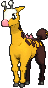
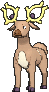

# Route 112 — Wild Pokémon

## [ South ]

### Grass

| Sprite | Pokémon | Encounter | Chance |
|:------:|---------|:---------:|--------|
|  | [Meowth](../../pokemon/meowth.md/) Lv. 23 |  Grass | 10% |
|  | [Ponyta](../../pokemon/ponyta.md/) Lv. 23 |  Grass | 10% |
|  | [Scyther](../../pokemon/scyther.md/) Lv. 23 |  Grass | 10% |
|  | [Tauros](../../pokemon/tauros.md/) Lv. 23 |  Grass | 10% |
|  | [Girafarig](../../pokemon/girafarig.md/) Lv. 23 |  Grass | 10% |
|  | [Stantler](../../pokemon/stantler.md/) Lv. 23 |  Grass | 10% |
|  | [Miltank](../../pokemon/miltank.md/) Lv. 23 |  Grass | 10% |
|  | [Blitzle](../../pokemon/blitzle.md/) Lv. 23 |  Grass | 10% |
|  | [Heatmor](../../pokemon/heatmor.md/) Lv. 23 |  Grass | 10% |
|  | [Durant](../../pokemon/durant.md/) Lv. 23 |  Grass | 10% |

### DexNav

| Sprite | Pokémon | Encounter | Chance |
|:------:|---------|:---------:|--------|
|  | [Scizor](../../pokemon/scizor.md/) Lv. 50 |  DexNav | 100% |

### Horde

| Sprite | Pokémon | Encounter | Chance |
|:------:|---------|:---------:|--------|
|  | [Durant](../../pokemon/durant.md/) Lv. 15 |  Horde | 100% |

## [ North ]

### Grass

| Sprite | Pokémon | Encounter | Chance |
|:------:|---------|:---------:|--------|
|  | [Ekans](../../pokemon/ekans.md/) Lv. 24 |  Grass | 10% |
|  | [Vulpix](../../pokemon/vulpix.md/) Lv. 24 |  Grass | 10% |
|  | [Pinsir](../../pokemon/pinsir.md/) Lv. 24 |  Grass | 10% |
|  | [Heracross](../../pokemon/heracross.md/) Lv. 24 |  Grass | 10% |
|  | [Elekid](../../pokemon/elekid.md/) Lv. 24 |  Grass | 10% |
|  | [Magby](../../pokemon/magby.md/) Lv. 24 |  Grass | 10% |
|  | [Throh](../../pokemon/throh.md/) Lv. 24 |  Grass | 10% |
|  | [Sawk](../../pokemon/sawk.md/) Lv. 24 |  Grass | 10% |
|  | [Mienfoo](../../pokemon/mienfoo.md/) Lv. 24 |  Grass | 10% |
|  | [Pawniard](../../pokemon/pawniard.md/) Lv. 24 |  Grass | 10% |

### DexNav

| Sprite | Pokémon | Encounter | Chance |
|:------:|---------|:---------:|--------|
|  | [Ninetales](../../pokemon/ninetales.md/) Lv. 50 |  DexNav | 100% |

### Horde

| Sprite | Pokémon | Encounter | Chance |
|:------:|---------|:---------:|--------|
|  | [Tyrogue](../../pokemon/tyrogue.md/) Lv. 15 |  Horde | 100% |

