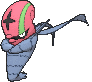
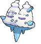

# Route 113 — Trainer Pokémon

## [ Main Area ]

### Trainer Rosters

### Rematches

| Trainer | P1 | P2 | P3 | P4 |
|:-------:|:--:|:--:|:--:|:--:|
| ") Ninja Boy Lao (4) [914] | 
 [Weezing](../../pokemon/weezing.md) Lv. 35
 | 
 [Accelgor](../../pokemon/accelgor.md) Lv. 35
 | 
 [Scolipede](../../pokemon/scolipede.md) Lv. 35
 | 
 [Escavalier](../../pokemon/escavalier.md) Lv. 35
 |
| ") Ninja Boy Lao (6) [915] | 
 [Weezing](../../pokemon/weezing.md) Lv. 47
 | 
 [Accelgor](../../pokemon/accelgor.md) Lv. 47
 | 
 [Scolipede](../../pokemon/scolipede.md) Lv. 47
 | 
 [Escavalier](../../pokemon/escavalier.md) Lv. 47
 |
| ") Ninja Boy Lao (8) [916] | 
 [Weezing](../../pokemon/weezing.md) Lv. 64
 | 
 [Accelgor](../../pokemon/accelgor.md) Lv. 64
 | 
 [Scolipede](../../pokemon/scolipede.md) Lv. 64
 | 
 [Escavalier](../../pokemon/escavalier.md) Lv. 64
 |
| ") Ninja Boy Lao (C) [917] | 
 [Weezing](../../pokemon/weezing.md) Lv. 75
 | 
 [Accelgor](../../pokemon/accelgor.md) Lv. 75
 | 
 [Scolipede](../../pokemon/scolipede.md) Lv. 75
 | 
 [Escavalier](../../pokemon/escavalier.md) Lv. 75
 |
| ") Parasol Lady Madeline (4) [619] | 
 [Camerupt](../../pokemon/camerupt.md) Lv. 35
 | 
 [Vanillish](../../pokemon/vanillish.md) Lv. 35
 | 
 [Musharna](../../pokemon/musharna.md) Lv. 35
 |
| ") Parasol Lady Madeline (6) [620] | 
 [Camerupt](../../pokemon/camerupt.md) Lv. 47
 | 
 [Vanilluxe](../../pokemon/vanilluxe.md) Lv. 47
 | 
 [Musharna](../../pokemon/musharna.md) Lv. 47
 | 
 [Starmie](../../pokemon/starmie.md) Lv. 47
 |
| ") Parasol Lady Madeline (8) [621] | 
 [Camerupt](../../pokemon/camerupt.md) Lv. 64
 | 
 [Vanilluxe](../../pokemon/vanilluxe.md) Lv. 64
 | 
 [Musharna](../../pokemon/musharna.md) Lv. 64
 | 
 [Starmie](../../pokemon/starmie.md) Lv. 64
 |
| ") Parasol Lady Madeline (C) [622] | 
 [Camerupt](../../pokemon/camerupt.md) Lv. 75
 | 
 [Vanilluxe](../../pokemon/vanilluxe.md) Lv. 75
 | 
 [Musharna](../../pokemon/musharna.md) Lv. 75
 | 
 [Starmie](../../pokemon/starmie.md) Lv. 75
 |

