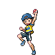
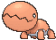
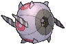
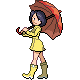
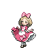
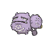

# Route 113 — Trainer Pokémon

---

## [ Main Area ]

### Trainer Rosters

| Trainer | P1 | P2 | P3 |
|:-------:|:--:|:--:|:--:|
|  Youngster Neal [086] | 
 [Trapinch](../../pokemon/trapinch.md) Lv. 28
 | 
 [Drowzee](../../pokemon/drowzee.md) Lv. 28
 | 
 [Ferroseed](../../pokemon/ferroseed.md) Lv. 28
 |
|  Ninja Boy Lao [591] | 
 [Koffing](../../pokemon/koffing.md) Lv. 28
 | 
 [Shelmet](../../pokemon/shelmet.md) Lv. 28
 | 
 [Whirlipede](../../pokemon/whirlipede.md) Lv. 28
 |
|  Parasol Lady Madeline [579] | 
 [Numel](../../pokemon/numel.md) Lv. 28
 | 
 [Vanillite](../../pokemon/vanillite.md) Lv. 28
 | 
 [Munna](../../pokemon/munna.md) Lv. 28
 |
|  Youngster Dillion [087] | 
 [Cacnea](../../pokemon/cacnea.md) Lv. 28
 | 
 [Spoink](../../pokemon/spoink.md) Lv. 28
 | 
 [Stunky](../../pokemon/stunky.md) Lv. 28
 |
|  Ninja Boy Lung [314] | 
 [Dustox](../../pokemon/dustox.md) Lv. 28
 | 
 [Sneasel](../../pokemon/sneasel.md) Lv. 28
 | 
 [Ninjask](../../pokemon/ninjask.md) Lv. 28
 |
|  Fairy Tale Girl Franny [767] | 
 [Swirlix](../../pokemon/swirlix.md) Lv. 28
 | 
 [Spritzee](../../pokemon/spritzee.md) Lv. 28
 | 
 [Togetic](../../pokemon/togetic.md) Lv. 28
 |

### Rematches

| Trainer | P1 | P2 | P3 | P4 |
|:-------:|:--:|:--:|:--:|:--:|
| ") Ninja Boy Lao (4) [914] | 
 [Weezing](../../pokemon/weezing.md) Lv. 35
 | 
 [Accelgor](../../pokemon/accelgor.md) Lv. 35
 | 
 [Scolipede](../../pokemon/scolipede.md) Lv. 35
 | 
 [Escavalier](../../pokemon/escavalier.md) Lv. 35
 |
| ") Ninja Boy Lao (6) [915] | 
 [Weezing](../../pokemon/weezing.md) Lv. 47
 | 
 [Accelgor](../../pokemon/accelgor.md) Lv. 47
 | 
 [Scolipede](../../pokemon/scolipede.md) Lv. 47
 | 
 [Escavalier](../../pokemon/escavalier.md) Lv. 47
 |
| ") Ninja Boy Lao (8) [916] | 
 [Weezing](../../pokemon/weezing.md) Lv. 64
 | 
 [Accelgor](../../pokemon/accelgor.md) Lv. 64
 | 
 [Scolipede](../../pokemon/scolipede.md) Lv. 64
 | 
 [Escavalier](../../pokemon/escavalier.md) Lv. 64
 |
| ") Ninja Boy Lao (C) [917] | 
 [Weezing](../../pokemon/weezing.md) Lv. 75
 | 
 [Accelgor](../../pokemon/accelgor.md) Lv. 75
 | 
 [Scolipede](../../pokemon/scolipede.md) Lv. 75
 | 
 [Escavalier](../../pokemon/escavalier.md) Lv. 75
 |
| ") Parasol Lady Madeline (4) [619] | 
 [Camerupt](../../pokemon/camerupt.md) Lv. 35
 | 
 [Vanillish](../../pokemon/vanillish.md) Lv. 35
 | 
 [Musharna](../../pokemon/musharna.md) Lv. 35
 |
| ") Parasol Lady Madeline (6) [620] | 
 [Camerupt](../../pokemon/camerupt.md) Lv. 47
 | 
 [Vanilluxe](../../pokemon/vanilluxe.md) Lv. 47
 | 
 [Musharna](../../pokemon/musharna.md) Lv. 47
 | 
 [Starmie](../../pokemon/starmie.md) Lv. 47
 |
| ") Parasol Lady Madeline (8) [621] | 
 [Camerupt](../../pokemon/camerupt.md) Lv. 64
 | 
 [Vanilluxe](../../pokemon/vanilluxe.md) Lv. 64
 | 
 [Musharna](../../pokemon/musharna.md) Lv. 64
 | 
 [Starmie](../../pokemon/starmie.md) Lv. 64
 |
| ") Parasol Lady Madeline (C) [622] | 
 [Camerupt](../../pokemon/camerupt.md) Lv. 75
 | 
 [Vanilluxe](../../pokemon/vanilluxe.md) Lv. 75
 | 
 [Musharna](../../pokemon/musharna.md) Lv. 75
 | 
 [Starmie](../../pokemon/starmie.md) Lv. 75
 |

