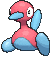
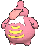
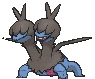

# Route 114 — Trainer Pokémon

### Trainer Rosters

### Rematches

| Trainer | P1 | P2 | P3 | P4 |
|:-------:|:--:|:--:|:--:|:--:|
| ") Poké Maniac Steve (6) [401] | 
 [Porygon2](../../pokemon/porygon2.md) Lv. 47
 | 
 [Lickilicky](../../pokemon/lickilicky.md) Lv. 47
 | 
 [Druddigon](../../pokemon/druddigon.md) Lv. 47
 | 
 [Zweilous](../../pokemon/zweilous.md) Lv. 47
 |
| ") Poké Maniac Steve (7) [402] | 
 [Porygon-Z](../../pokemon/porygon-z.md) Lv. 59
 | 
 [Lickilicky](../../pokemon/lickilicky.md) Lv. 59
 | 
 [Druddigon](../../pokemon/druddigon.md) Lv. 59
 | 
 [Zweilous](../../pokemon/zweilous.md) Lv. 59
 |
| ") Poké Maniac Steve (8) [403] | 
 [Porygon-Z](../../pokemon/porygon-z.md) Lv. 64
 | 
 [Lickilicky](../../pokemon/lickilicky.md) Lv. 64
 | 
 [Druddigon](../../pokemon/druddigon.md) Lv. 64
 | 
 [Zweilous](../../pokemon/zweilous.md) Lv. 64
 |
| ") Poké Maniac Steve (C) [404] | 
 [Porygon-Z](../../pokemon/porygon-z.md) Lv. 75
 | 
 [Lickilicky](../../pokemon/lickilicky.md) Lv. 75
 | 
 [Druddigon](../../pokemon/druddigon.md) Lv. 75
 | 
 [Hydreigon](../../pokemon/hydreigon.md) Lv. 75
 |
| ") Kindler Bernie (4) [405] | 
 [Simisear](../../pokemon/simisear.md) Lv. 35
 | 
 [Pelipper](../../pokemon/pelipper.md) Lv. 35
 |
| ") Kindler Bernie (6) [406] | 
 [Simisear](../../pokemon/simisear.md) Lv. 47
 | 
 [Pelipper](../../pokemon/pelipper.md) Lv. 47
 | 
 [Magmar](../../pokemon/magmar.md) Lv. 47
 | 
 [Octillery](../../pokemon/octillery.md) Lv. 47
 |
| ") Kindler Bernie (7) [407] | 
 [Simisear](../../pokemon/simisear.md) Lv. 59
 | 
 [Pelipper](../../pokemon/pelipper.md) Lv. 59
 | 
 [Magmortar](../../pokemon/magmortar.md) Lv. 59
 | 
 [Octillery](../../pokemon/octillery.md) Lv. 59
 |
| ") Kindler Bernie (C) [408] | 
 [Simisear](../../pokemon/simisear.md) Lv. 75
 | 
 [Pelipper](../../pokemon/pelipper.md) Lv. 75
 | 
 [Magmortar](../../pokemon/magmortar.md) Lv. 75
 | 
 [Octillery](../../pokemon/octillery.md) Lv. 75
 |

