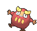
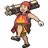

# Route 114 — Trainer Pokémon

---

## [ Main Area ]

### Trainer Rosters

| Trainer | P1 | P2 | P3 | P4 |
|:-------:|:--:|:--:|:--:|:--:|
|  Fisherman Claude [015] | 
 [Lumineon](../../pokemon/lumineon.md) Lv. 31
 |
|  Fisherman Nolan [272] | 
 [Gyarados](../../pokemon/gyarados.md) Lv. 31
 |
|  Teammates Tyra & Ivy [632] | 
 [Roselia](../../pokemon/roselia.md) Lv. 31
 | 
 [Azumarill](../../pokemon/azumarill.md) Lv. 32
 |
|  Poké Maniac Steve [094] | 
 [Porygon](../../pokemon/porygon.md) Lv. 28
 | 
 [Lickitung](../../pokemon/lickitung.md) Lv. 28
 | 
 [Druddigon](../../pokemon/druddigon.md) Lv. 28
 | 
 [Deino](../../pokemon/deino.md) Lv. 28
 |
|  Camper Shane [092] | 
 [Aipom](../../pokemon/aipom.md) Lv. 28
 | 
 [Sandile](../../pokemon/sandile.md) Lv. 28
 | 
 [Pineco](../../pokemon/pineco.md) Lv. 28
 | 
 [Darumaka](../../pokemon/darumaka.md) Lv. 28
 |
|  Kindler Bernie [366] | 
 [Simisear](../../pokemon/simisear.md) Lv. 30
 | 
 [Pelipper](../../pokemon/pelipper.md) Lv. 30
 |
|  Hiker Lucas [091] | 
 [Carbink](../../pokemon/carbink.md) Lv. 30
 | 
 [Shuckle](../../pokemon/shuckle.md) Lv. 30
 |
|  Hiker Lenny [090] | 
 [Gurdurr](../../pokemon/gurdurr.md) Lv. 29
 | 
 [Gligar](../../pokemon/gligar.md) Lv. 29
 | 
 [Marowak](../../pokemon/marowak.md) Lv. 29
 |

### Rematches

| Trainer | P1 | P2 | P3 | P4 |
|:-------:|:--:|:--:|:--:|:--:|
| ") Poké Maniac Steve (6) [401] | 
 [Porygon2](../../pokemon/porygon2.md) Lv. 47
 | 
 [Lickilicky](../../pokemon/lickilicky.md) Lv. 47
 | 
 [Druddigon](../../pokemon/druddigon.md) Lv. 47
 | 
 [Zweilous](../../pokemon/zweilous.md) Lv. 47
 |
| ") Poké Maniac Steve (7) [402] | 
 [Porygon-Z](../../pokemon/porygon-z.md) Lv. 59
 | 
 [Lickilicky](../../pokemon/lickilicky.md) Lv. 59
 | 
 [Druddigon](../../pokemon/druddigon.md) Lv. 59
 | 
 [Zweilous](../../pokemon/zweilous.md) Lv. 59
 |
| ") Poké Maniac Steve (8) [403] | 
 [Porygon-Z](../../pokemon/porygon-z.md) Lv. 64
 | 
 [Lickilicky](../../pokemon/lickilicky.md) Lv. 64
 | 
 [Druddigon](../../pokemon/druddigon.md) Lv. 64
 | 
 [Zweilous](../../pokemon/zweilous.md) Lv. 64
 |
| ") Poké Maniac Steve (C) [404] | 
 [Porygon-Z](../../pokemon/porygon-z.md) Lv. 75
 | 
 [Lickilicky](../../pokemon/lickilicky.md) Lv. 75
 | 
 [Druddigon](../../pokemon/druddigon.md) Lv. 75
 | 
 [Hydreigon](../../pokemon/hydreigon.md) Lv. 75
 |
| ") Kindler Bernie (4) [405] | 
 [Simisear](../../pokemon/simisear.md) Lv. 35
 | 
 [Pelipper](../../pokemon/pelipper.md) Lv. 35
 |
| ") Kindler Bernie (6) [406] | 
 [Simisear](../../pokemon/simisear.md) Lv. 47
 | 
 [Pelipper](../../pokemon/pelipper.md) Lv. 47
 | 
 [Magmar](../../pokemon/magmar.md) Lv. 47
 | 
 [Octillery](../../pokemon/octillery.md) Lv. 47
 |
| ") Kindler Bernie (7) [407] | 
 [Simisear](../../pokemon/simisear.md) Lv. 59
 | 
 [Pelipper](../../pokemon/pelipper.md) Lv. 59
 | 
 [Magmortar](../../pokemon/magmortar.md) Lv. 59
 | 
 [Octillery](../../pokemon/octillery.md) Lv. 59
 |
| ") Kindler Bernie (C) [408] | 
 [Simisear](../../pokemon/simisear.md) Lv. 75
 | 
 [Pelipper](../../pokemon/pelipper.md) Lv. 75
 | 
 [Magmortar](../../pokemon/magmortar.md) Lv. 75
 | 
 [Octillery](../../pokemon/octillery.md) Lv. 75
 |

