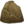

# Route 114 — Wild Pokémon

### Grass

| Sprite | Pokémon | Encounter Type | Level | Chance |
|:------:|---------|:--------------:|-------|--------|
|  | [Drowzee](../../pokemon/drowzee.md/) |  Grass | 25 | 10% |
|  | [Lickitung](../../pokemon/lickitung.md/) |  Grass | 25 | 10% |
|  | [Misdreavus](../../pokemon/misdreavus.md/) |  Grass | 25 | 10% |
|  | [Swablu](../../pokemon/swablu.md/) |  Grass | 25 | 10% |
|  | [Zangoose](../../pokemon/zangoose.md/) |  Grass | 25 | 10% |
|  | [Seviper](../../pokemon/seviper.md/) |  Grass | 25 | 10% |
|  | [Skorupi](../../pokemon/skorupi.md/) |  Grass | 25 | 10% |
|  | [Vanillite](../../pokemon/vanillite.md/) |  Grass | 25 | 10% |
|  | [Karrablast](../../pokemon/karrablast.md/) |  Grass | 25 | 10% |
|  | [Shelmet](../../pokemon/shelmet.md/) |  Grass | 25 | 10% |

### Rock Smash

| Sprite | Pokémon | Encounter Type | Level | Chance |
|:------:|---------|:--------------:|-------|--------|
|  | [Graveler](../../pokemon/graveler.md/) |  Rock Smash | 25 | 50% |
|  | [Boldore](../../pokemon/boldore.md/) |  Rock Smash | 25 | 50% |

### DexNav

| Sprite | Pokémon | Encounter Type | Level | Chance |
|:------:|---------|:--------------:|-------|--------|
|  | [Lickilicky](../../pokemon/lickilicky.md/) |  DexNav | 50 | 100% |

### Horde

| Sprite | Pokémon | Encounter Type | Level | Chance |
|:------:|---------|:--------------:|-------|--------|
|  | [Vanillite](../../pokemon/vanillite.md/) |  Horde | 15 | 100% |

### Surfing

| Sprite | Pokémon | Encounter Type | Level | Chance |
|:------:|---------|:--------------:|-------|--------|
|  | [Hoppip](../../pokemon/hoppip.md/) |  Surfing | 25 - 35 | 50% |
|  | [Skiploom](../../pokemon/skiploom.md/) |  Surfing | 25 - 35 | 50% |

### Old Rod

| Sprite | Pokémon | Encounter Type | Level | Chance |
|:------:|---------|:--------------:|-------|--------|
|  | [Qwilfish](../../pokemon/qwilfish.md/) |  Old Rod | 25 | 100% |

### Good Rod

| Sprite | Pokémon | Encounter Type | Level | Chance |
|:------:|---------|:--------------:|-------|--------|
|  | [Qwilfish](../../pokemon/qwilfish.md/) |  Good Rod | 35 | 100% |

### Super Rod

| Sprite | Pokémon | Encounter Type | Level | Chance |
|:------:|---------|:--------------:|-------|--------|
|  | [Qwilfish](../../pokemon/qwilfish.md/) |  Super Rod | 55 | 100% |

