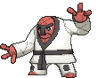

# Route 115 — Trainer Pokémon

### Generic Trainers

### Rematches

| Trainer | P1 | P2 | P3 | P4 | P5 |
|:-------:|:--:|:--:|:--:|:--:|:--:|
| ") Battle Girl Cyndy (5) [409] | 
 [Throh](../../pokemon/throh.md) Lv. 39
 | 
 [Breloom](../../pokemon/breloom.md) Lv. 39
 | 
 [Hitmonchan](../../pokemon/hitmonchan.md) Lv. 39
 |
| ") Battle Girl Cyndy (7) [410] | 
 [Throh](../../pokemon/throh.md) Lv. 59
 | 
 [Breloom](../../pokemon/breloom.md) Lv. 59
 | 
 [Hitmonchan](../../pokemon/hitmonchan.md) Lv. 59
 | 
 [Conkeldurr](../../pokemon/conkeldurr.md) Lv. 59
 |
| ") Battle Girl Cyndy (8) [411] | 
 [Throh](../../pokemon/throh.md) Lv. 64
 | 
 [Breloom](../../pokemon/breloom.md) Lv. 64
 | 
 [Hitmonchan](../../pokemon/hitmonchan.md) Lv. 64
 | 
 [Conkeldurr](../../pokemon/conkeldurr.md) Lv. 64
 |
| ") Battle Girl Cyndy (C) [412] | 
 [Throh](../../pokemon/throh.md) Lv. 75
 | 
 [Breloom](../../pokemon/breloom.md) Lv. 75
 | 
 [Hitmonlee](../../pokemon/hitmonlee.md) Lv. 75
 | 
 [Conkeldurr](../../pokemon/conkeldurr.md) Lv. 75
 |
| ") Black Belt Nob (5) [203] | 
 [Sawk](../../pokemon/sawk.md) Lv. 39
 | 
 [Pangoro](../../pokemon/pangoro.md) Lv. 39
 | 
 [Hitmonlee](../../pokemon/hitmonlee.md) Lv. 39
 |
| ") Black Belt Nob (7) [204] | 
 [Sawk](../../pokemon/sawk.md) Lv. 59
 | 
 [Pangoro](../../pokemon/pangoro.md) Lv. 59
 | 
 [Hitmonlee](../../pokemon/hitmonlee.md) Lv. 59
 | 
 [Machamp](../../pokemon/machamp.md) Lv. 59
 |
| ") Black Belt Nob (8) [205] | 
 [Sawk](../../pokemon/sawk.md) Lv. 64
 | 
 [Pangoro](../../pokemon/pangoro.md) Lv. 64
 | 
 [Hitmonlee](../../pokemon/hitmonlee.md) Lv. 64
 | 
 [Machamp](../../pokemon/machamp.md) Lv. 64
 |
| ") Black Belt Nob (C) [643] | 
 [Sawk](../../pokemon/sawk.md) Lv. 75
 | 
 [Pangoro](../../pokemon/pangoro.md) Lv. 75
 | 
 [Hitmonlee](../../pokemon/hitmonlee.md) Lv. 75
 | 
 [Machamp](../../pokemon/machamp.md) Lv. 75
 |
| ") Expert Timothy (5) [606] | 
 [Hitmonlee](../../pokemon/hitmonlee.md) Lv. 40
 | 
 [Hitmonchan](../../pokemon/hitmonchan.md) Lv. 40
 | 
 [Hitmontop](../../pokemon/hitmontop.md) Lv. 40
 |
| ") Expert Timothy (7) [607] | 
 [Hitmonlee](../../pokemon/hitmonlee.md) Lv. 59
 | 
 [Hitmonchan](../../pokemon/hitmonchan.md) Lv. 59
 | 
 [Hitmontop](../../pokemon/hitmontop.md) Lv. 59
 | 
 [Hariyama](../../pokemon/hariyama.md) Lv. 59
 |
| ") Expert Timothy (8) [608] | 
 [Hitmonlee](../../pokemon/hitmonlee.md) Lv. 64
 | 
 [Hitmonchan](../../pokemon/hitmonchan.md) Lv. 64
 | 
 [Hitmontop](../../pokemon/hitmontop.md) Lv. 64
 | 
 [Hariyama](../../pokemon/hariyama.md) Lv. 64
 |
| ") Expert Timothy (C) [609] | 
 [Hitmonlee](../../pokemon/hitmonlee.md) Lv. 75
 | 
 [Hitmonchan](../../pokemon/hitmonchan.md) Lv. 75
 | 
 [Hitmontop](../../pokemon/hitmontop.md) Lv. 75
 | 
 [Hariyama](../../pokemon/hariyama.md) Lv. 75
 | 
 [Heracross](../../pokemon/heracross.md) Lv. 75
 |

