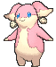
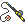

# Route 115 — Wild Pokémon

---

## [ Main Area ]

### Grass

| Sprite | Pokémon | Encounter | Chance |
|:------:|---------|:---------:|--------|
|  | [Jigglypuff](../../pokemon/jigglypuff.md/) Lv. 35 |  Grass | 10% |
|  | [Ditto](../../pokemon/ditto.md/) Lv. 35 |  Grass | 10% |
|  | [Tangela](../../pokemon/tangela.md/) Lv. 35 |  Grass | 10% |
|  | [Sunkern](../../pokemon/sunkern.md/) Lv. 35 |  Grass | 10% |
|  | [Yanma](../../pokemon/yanma.md/) Lv. 35 |  Grass | 10% |
|  | [Swellow](../../pokemon/swellow.md/) Lv. 35 |  Grass | 10% |
|  | [Munna](../../pokemon/munna.md/) Lv. 35 |  Grass | 10% |
|  | [Audino](../../pokemon/audino.md/) Lv. 35 |  Grass | 10% |
|  | [Floette](../../pokemon/floette.md/) Lv. 35 |  Grass | 10% |
|  | [Hawlucha](../../pokemon/hawlucha.md/) Lv. 35 |  Grass | 10% |

### DexNav

| Sprite | Pokémon | Encounter | Chance |
|:------:|---------|:---------:|--------|
|  | [Yanmega](../../pokemon/yanmega.md/) Lv. 50 |  DexNav | 100% |

### Horde

| Sprite | Pokémon | Encounter | Chance |
|:------:|---------|:---------:|--------|
|  | [Igglybuff](../../pokemon/igglybuff.md/) Lv. 22 |  Horde | 50% |
|  | [Ditto](../../pokemon/ditto.md/) Lv. 22 |  Horde | 50% |

### Surfing

| Sprite | Pokémon | Encounter | Chance |
|:------:|---------|:---------:|--------|
|  | [Tentacool](../../pokemon/tentacool.md/) Lv. 25 - 35 |  Surfing | 50% |
|  | [Tentacruel](../../pokemon/tentacruel.md/) Lv. 25 - 35 |  Surfing | 50% |

### Old Rod

| Sprite | Pokémon | Encounter | Chance |
|:------:|---------|:---------:|--------|
|  | [Magikarp](../../pokemon/magikarp.md/) Lv. 15 |  Old Rod | 100% |

### Good Rod

| Sprite | Pokémon | Encounter | Chance |
|:------:|---------|:---------:|--------|
|  | [Magikarp](../../pokemon/magikarp.md/) Lv. 35 |  Good Rod | 100% |

### Super Rod

| Sprite | Pokémon | Encounter | Chance |
|:------:|---------|:---------:|--------|
|  | [Gyarados](../../pokemon/gyarados.md/) Lv. 55 |  Super Rod | 100% |

