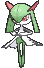

# Route 116 — Trainer Pokémon

## [ Main Area ]

### Trainer Rosters

### Rematches

| Trainer | P1 | P2 | P3 | P4 |
|:-------:|:--:|:--:|:--:|:--:|
| ") Schoolkid Jerry (2) [413] | 
 [Ralts](../../pokemon/ralts.md) Lv. 16
 | 
 [Solosis](../../pokemon/solosis.md) Lv. 16
 |
| ") Schoolkid Jerry (4) [414] | 
 [Pawniard](../../pokemon/pawniard.md) Lv. 35
 | 
 [Duosion](../../pokemon/duosion.md) Lv. 35
 | 
 [Kirlia](../../pokemon/kirlia.md) Lv. 35
 |
| ") Schoolkid Jerry (6) [415] | 
 [Bisharp](../../pokemon/bisharp.md) Lv. 47
 | 
 [Reuniclus](../../pokemon/reuniclus.md) Lv. 47
 | 
 [Gardevoir](../../pokemon/gardevoir.md) Lv. 47
 | 
 [Medicham](../../pokemon/medicham.md) Lv. 47
 |
| ") Schoolkid Jerry (C) [416] | 
 [Bisharp](../../pokemon/bisharp.md) Lv. 75
 | 
 [Reuniclus](../../pokemon/reuniclus.md) Lv. 75
 | 
 [Gardevoir](../../pokemon/gardevoir.md) Lv. 75
 | 
 [Medicham](../../pokemon/medicham.md) Lv. 75
 |
| ") Schoolkid Karen (2) [417] | 
 [Togepi](../../pokemon/togepi.md) Lv. 16
 | 
 [Gothita](../../pokemon/gothita.md) Lv. 16
 |
| ") Schoolkid Karen (4) [418] | 
 [Loudred](../../pokemon/loudred.md) Lv. 35
 | 
 [Gothorita](../../pokemon/gothorita.md) Lv. 35
 | 
 [Togetic](../../pokemon/togetic.md) Lv. 35
 |
| ") Schoolkid Karen (6) [419] | 
 [Exploud](../../pokemon/exploud.md) Lv. 47
 | 
 [Gothitelle](../../pokemon/gothitelle.md) Lv. 47
 | 
 [Togekiss](../../pokemon/togekiss.md) Lv. 47
 | 
 [Exeggutor](../../pokemon/exeggutor.md) Lv. 47
 |
| ") Schoolkid Karen (C) [420] | 
 [Exploud](../../pokemon/exploud.md) Lv. 75
 | 
 [Gothitelle](../../pokemon/gothitelle.md) Lv. 75
 | 
 [Togekiss](../../pokemon/togekiss.md) Lv. 75
 | 
 [Exeggutor](../../pokemon/exeggutor.md) Lv. 75
 |

