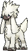

# Route 116 — Wild Pokémon

### Grass

| Sprite | Pokémon | Encounter | Chance |
|:------:|---------|:---------:|--------|
|  | [Growlithe](../../pokemon/growlithe.md/) Lv. 10 |  Grass | 10% |
|  | [Doduo](../../pokemon/doduo.md/) Lv. 10 |  Grass | 10% |
|  | [Natu](../../pokemon/natu.md/) Lv. 10 |  Grass | 10% |
|  | [Mareep](../../pokemon/mareep.md/) Lv. 10 |  Grass | 10% |
|  | [Houndour](../../pokemon/houndour.md/) Lv. 10 |  Grass | 10% |
|  | [Phanpy](../../pokemon/phanpy.md/) Lv. 10 |  Grass | 10% |
|  | [Skitty*](../../pokemon/skitty.md/) Lv. 10 |  Grass | 5% |
|  | [Shinx](../../pokemon/shinx.md/) Lv. 10 |  Grass | 10% |
|  | [Litleo](../../pokemon/litleo.md/) Lv. 10 |  Grass | 10% |
|  | [Pancham](../../pokemon/pancham.md/) Lv. 10 |  Grass | 10% |
|  | [Furfrou*](../../pokemon/furfrou.md/) Lv. 10 |  Grass | 5% |

### DexNav

| Sprite | Pokémon | Encounter | Chance |
|:------:|---------|:---------:|--------|
|  | [Delcatty](../../pokemon/delcatty.md/) Lv. 50 |  DexNav | 100% |

### Horde

| Sprite | Pokémon | Encounter | Chance |
|:------:|---------|:---------:|--------|
|  | [Eevee](../../pokemon/eevee.md/) Lv. 10 |  Horde | 100% |

